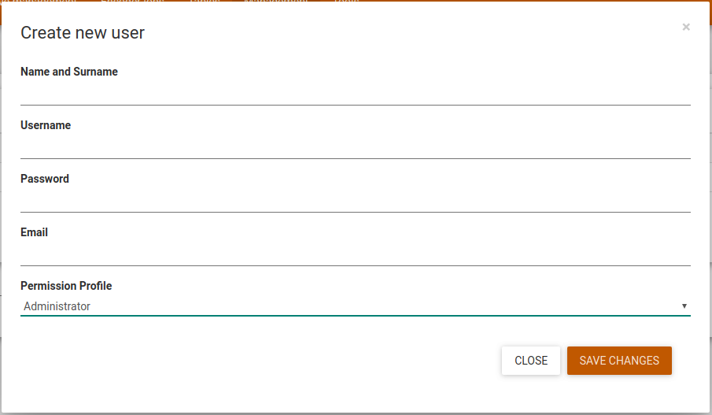
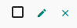
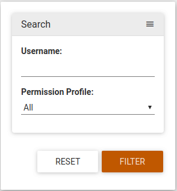
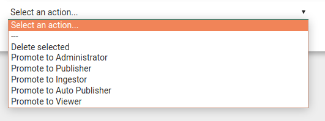
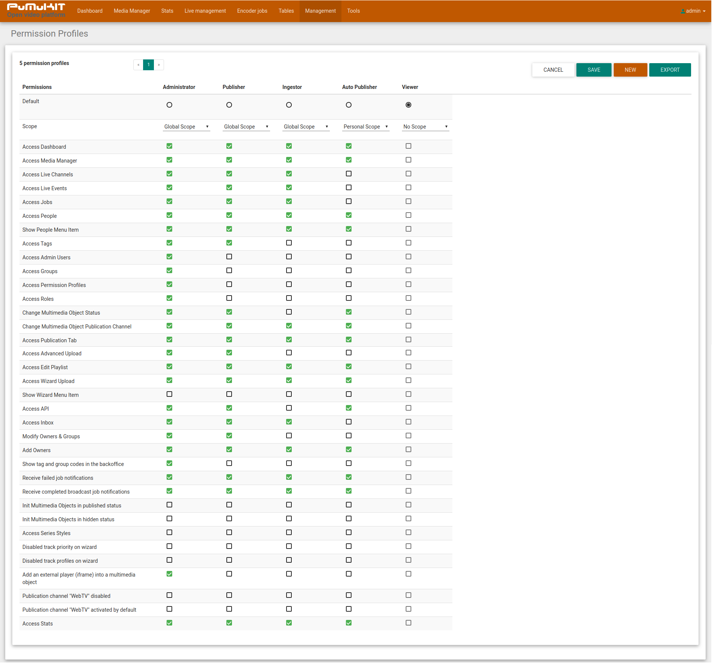
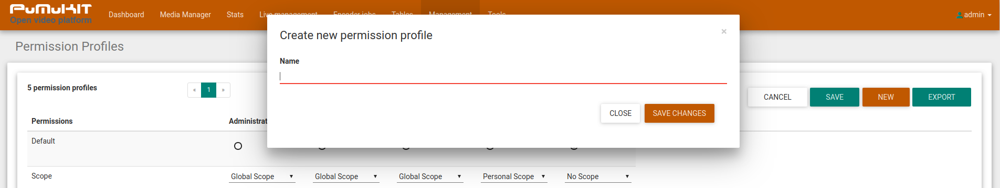
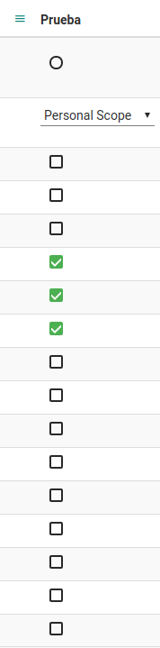
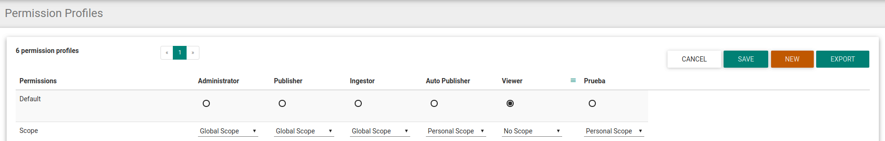
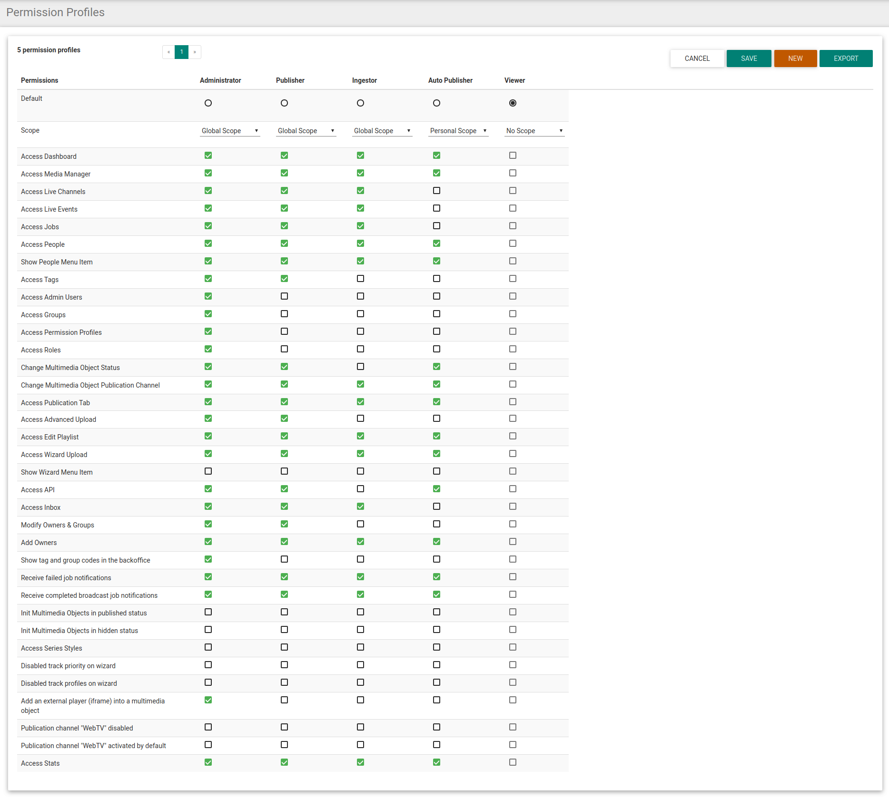
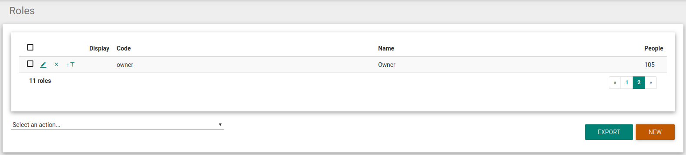

PuMuKIT SysAdmin Guide
========================

## Table of contents

1. [General Overview](#1-general-overview)

  1.1 [Terminology](#11-terminology)
  
  1.2 [PuMuKIT Overview](#12-pumukit-overview)
  
2. [Pumukit Software Management Tools](#2-pumukit-software-management-tools)

  2.1 [Admin users tool](#21-admin-users-tool)

  2.1.1 [How to create a new user](#211-how-to-create-a-new-user)

  2.1.2 [Edit and delete users](#212-edit-and-delete-users)

  2.1.3 [Filtering users](#213-filtering-users)

  2.1.4 [Executing an action on several users](#214-executing-an-action-on-several-users)
  
  2.2 [Permission Profiles Management](#22-permission-profiles-management)

  2.2.1 [Managing Permission Profiles](#221-managing-permission-profiles)

  2.2.1.1 [Create new permission profile](#2221-create-nee-permission-profile)

  2.2.1.2 [Edit an existing permission profile](#2212-edit-an-existing-permission-profile)

  2.2.1.3 [Deleting a Permission Profile](#2213-deleting-a-permission-profile)

  2.2.1.4 [Default Permission Profile](#2214-default-permission-profile)

  2.2.2 [Types of Scope](#222-types-of-scope)

  2.2.2.1 [Global Scope](#2221-global-scope)

  2.2.2.2 [Personal Scope](#2222-personal-scope)

  2.2.2.3 [No scope](#2223-no-scope)

  2.2.3 [Permissions explained](#223-permissions-explained)

  2.3 [Roles tool](#23-roles-tool)
  
  2.3.1 [The owner role](#231-the-owner-role)
  
3. [Other Management Tools](#3-other-management-tools)

  3.1 [Encoder Jobs](#31-encoder-jobs)
  
  3.2 [Tables](#32-multimedia-object-metadata-edition)
  
  3.2.1 [People table](#321-people-table)
    
  3.2.2 [Tags table](#322-tags-table)

  
# 1 General Overview

## 1.1 Terminology 

-   **Series**: Ordered collection of multimedia objects.

-   **Multimedia Objects**: Set of media files (audio or video files), metadata and attachments (related files like ppts, pdfs, etc...). A multimedia object is composed of:
	
    - Several multimedia files: the "master" copy with maximum quality and one or several "distribution" or "delivery" copies, of the same media, encoded with different qualities or codecs.

    - Descriptive metadata, temporal and spatial-location metadata, presentation metadata and access-authorization metadata.

    - Subject area metadata.

    - Metadata about the people that takes part in the multimedia object production and their roles.

    - Attached files (PDF, PPT, etc...) and URLs that complete the content of the multimedia object.

-   **PuMuKIT (Back-Office):** The PuMuKIT back-office is a modular web application designed to manage the series and multimedia objects of a PuMuKIT video platform. Using this back-office you will be able to ingest, catalogue and publish your media (audio and video assets) to different channels: The internal Video Portal, iTunesU, YouTube, etc...

-   **Video-Portal (Web-TV):** The video focused, youtube-like, website generated by PuMuKIT.

-   **Metadata:**Editable information of a multimedia object (title, subtitle, keyword, copyright, genre, publish date, recording date, description).

-   **Modules:**Different sections of a PuMuKIT platform.

-   **Mono-stream content:** A multimedia object based on a single video or audio.

-   **Dual-stream content:** A multimedia object based on two videos, one for presenter and one for presentation. These videos are played simultaneously and they are usually stored in an opencast platform.

## 1.2 PuMuKIT Overview

PuMuKIT is a powerful Open-Source video platform, it provides great media cataloguing capabilities as well as the required flexibility needed to manage your media collections. PuMuKIT is specially designed for organizations with large collections of video and/or audio assets.

PuMuKIT can automate the publication process of your media through different online publishing channels such as Video-Portals (WebTV), different RSS feeds, iTunesU sites, YouTube channels or DSpace repositories.

Figure 1. PuMuKit’s frontend

# 2 Pumukit Software Management Tools

PuMuKIT"s back-office offers several tools to perform most of the GaliSERVER management tasks. In this section, the different management tools available will be explained.
For common media management tasks please check "PuMuKIT Content Manager Guide".

## 2.1 Admin users tool

Using this tool you can manage all users with access to PuMuKIT. Through this module, you can create, edit and delete users.
To access the "Admin users" tool click on "Management > Admin users".

Figure 2. Admin user module

The permissions that a certain user is granted is managed through the Permission Profiles tool. A user can be assigned one of the default Permission Profiles, or a custom one created through the Permission Profiles Management Tool (See section 2.2 Permission Profiles).

### 2.1.1 How to create a new user

To create a new user, click on the "New" button on the bottom right corner of the screen. A new window will appear to fill the required fields for the new user to be created:

Figure 3. Create new user window

The required fields for a user are listed below:
-   **Name and Surname**: This field will be the name that the user will have on the platform.
-   **Username**: This field will be the username required to log into PuMuKIT or the video portal.
-   **Password**: This field will be the password required to log into PuMuKIT or the video portal.
-   **Email**: This field will be the email associated with our user. This email is later used to link a certain user with the corresponding Person (See section 3.2.1 – People table)
-   **Permission Profile**: This field will be the „Permission Profile" set for this user. The user's Permission Profile will determine which sections and functionality can be accessed by this user.
Finally, click on "Save Changes" to create the user and save it to PuMuKIT.

### 2.1.2 Edit and delete users

The edit and the delete icons are located in the left side of the users table:

Figure 4. Edit/delete icons

Clicking on the edit icon will open a window similar to the "Create new user" window (view figure 3 – "Create new user window" above). Using this window you will be able to replace the values of the user's fields with new ones.
Clicking on the delete icon will permanently delete the user from PuMuKIT.

### 2.1.3 Filtering users

At the right side of the screen, there is a search filter that allows you to filter the users that are displayed at the users table.

Figure 5. Admin User Search

Users can be filtered by doing search on their username field, or by the Permission Profile assigned to them.

### 2.1.4 Executing an action on several users

Several users can be selected by clicking on their respective checkboxes at the left side of the users table.
If you click on the ‘Select an action...’ option, a pull-down list will be shown where you can select from several actions to carry out on the selected users:
-   **Delete selected**: This action will delete all the selected users.
-   **Promote to...**: This action will change the Permission Profile of all the selected users to the chosen one.

An example of this pull-down list is shown in the image below:

Figure 6. Select an action option

## 2.2 Permission Profiles Management

It is a module that allows you to manage access permissions for different types of users.
There are 5 default Permission Profiles:
-   **Administrator**: It is the System administrator. It has full access to everything.
-   **Publisher**: This person is the content administrator of the platform. It has access to all the modules except the "Management" menu. (Including Admin users, Permission Profiles editing and Roles editing).
-   **Ingestor**: People that only can have restricted access to manage the multimedia content in the back office. It does not have access to the "Management" menu (as before), it cannot access the tags and series types Tables. It cannot change the multimedia object status. It can only upload videos through the Wizard or through the OC-Importer.
-   **Autopublisher**: They are people that can manage only their own multimedia content. It has the same restrictions as the "Ingestor". It cannot access the "Live" menu (live channels and events). It cannot access the OC-Importer. It only has access to the series and multimedia objects he creates. ("Owner" role. Check Section 2.3.1 for more details). It cannot access the Galicaster FM, the Server Panel or Opencast.
-   **Viewer**: People that only has authenticated access to video portal, it cannot access to PuMuKIT back office.
These default profiles cannot be edited, however, you can create as many custom Permission Profiles as you need by clicking on the "New" button at the top right corner.

Figure 7. Permission Profile module

### 2.2.1 Managing Permission Profiles

#### 2.2.1.1 Create new permission profile

To create a new Permission Profile click on "New", at the top right corner. A pop-up window will appear where you can add the Name of your new Permission Profile.

Figure 8. Creating new Permission profile

After clicking on "Save Changes" a new Permission Profile with "Personal Scope" and with no permissions will be added to the Permission Profiles list. This new Permission Profile can then be edited further.

#### 2.2.1.2 Edit and existing permission profile

After a Permission Profile is created, you can add new permissions to it. To add or remove permission, use the checkboxes below the Permission profile to select the permissions you want that Permission Profile to have. 

Figure 9. Editing new Permission profile

You can also change the Permission Profile name by clicking on the hamburger icon at the left of its name, then on the "Edit the permission profile" option. A window will appear, similar to the one used to create a new Permission Profile, where you can add a new name.

Also, above the checkboxes you have a drop-down select that allows you to change the scope of the Permission profile. The scope by default is "Personal Scope". (See section 2.2.2 Types of Scope).

Figure 10. Profile List

#### 2.2.1.3 Deleting a permission profile

You can delete a Permission Profile by clicking on the hamburger icon on its name, then clicking on "Delete the Permission Profile".

#### 2.2.1.4 Default Permission Profile

The Permission Profile set as "default" will be selected when creating a new User as their Permission Profile. To make a Permission Profile the default one, click on the radio-button under its name. 

Figure 11. A default Permission Profile (radio-button checked)

### 2.2.2 Types of Scope

There are three types of scope: Global, Personal and None:

##### 2.2.2.1 Global Scope

Users with a global scope have access to the series and multimedia objects of all users. A user with global scope can delete any multimedia object or series.

##### 2.2.2.2 Personal Scope

Personal scope users only have access to the series and multimedia objects they have created. If you remove yourself from the „Owner" Role of a multimedia object, you will no longer have access to it. A user with personal scope can add other users to a series or Multimedia Object (in People, role owner. See section 2.3.1 The Owner Role).

A user with personal scope cannot delete other users from multimedia object or series, except for himself (in People, role owner).

A user can only delete a multimedia object or series if there are no other users as owners of the multimedia object. (See Section 2.3.1-The Owner Role). In the case of the series, the user can only delete it if all multimedia objects within the series belong to him and none of them belong to other users.

##### 2.2.2.1 No Scope

A user with No Scope only has access to the video portal.

### 2.2.3 Permissions explained

The permissions that you can assign to each profile are displayed in the Permission Profiles table. Some Permission are only listed if the correspondent bundle is installed.

Figure 12. Permission List

Here is an exhaustive list of the currently available Permission items:
-   Access Dashboard: it gives access to the dashboard module
-   Access Media Manager: it gives access to the Media manager module
-   Access Live Channels: it gives access to the Channel Configuration sub-module
-   Access Live events: it gives access to the Live Events sub-module
-   Access Jobs: it gives access the Encoder Jobs module
-   Access People: it gives access to the People sub-module
-   Show People Menu Item: it hides People sub-module but allows enter in the module if you know the module URL.
-   Access Tags: it gives access to the Tags sub-module
-   Access Admin Users: it gives access Admin Users module
-   Access Groups: it gives access to Groups sub-module
-   Access Permission Profiles: it gives access to module that allows us to manage permissions.
-   Access Roles: it gives access to Roles module.
-   Change Multimedia Object Status: it gives access to the tab where you can change the status of the multimedia objects.
-   Change Multimedia Object Publication Channel: it gives access to a set of selectors that allow you to publish a multimedia object in the different online channels.
-   Access Publication Tab: it gives access to tab that includes metadata related to the publication of a multimedia object.
-   Access Advanced Upload: it gives access to upload videos through "New" button.
-   Access Edit Playlist: it gives access to Moodle Playlists module.
-   Access Wizard Upload: it gives access to the wizard that will guide you through the steps of the creation and cataloguing of mono-stream content.
-   Show Wizard Menu Item: it enables a direct access to Wizard in the PuMuKIT menu.
-   Access API: it gives access to the URL path "/api".
-   Access Inbox: it gives access to the inbox.
-   Modify Owner & Groups: it gives access to this permission allows you to modify the owner of a video.
     - A user without the permission "Modify Owner" cannot add, delete or edit the "owner "of a multimedia object (including itself).
     - A user with the permission "Modify Owner" can add and remove any user from the "owner" property of a multimedia object.
     - A user with Global Scope is owner of all the videos, in the sense that if it is removed from the same video, still seeing it listed and can be accessed.
-   Add Owners: it enables "new" button in the Owner metadata section.
-   Show tag and group codes in the backoffice: it enables the view the tag and group codes when you are in "Tags" section of metadata edition.
-   Receive failed job notifications: It allows that the user received a mail when a transcode job failed.
-   Receive completed broadcast job notifications: It allows that the user received a mail for every transcode job.
-   Init Multimedia Objects in published status: When is activate, every OM is created in published status (By default every MO is created in blocked status).
-   Init Multimedia Objects in hidden status: When is activate, every OM is created in hidden status.
-   Access Series Styles: It gives access to Series Styles module.
-   Disabled track priority on wizard: It disables the option to choose the track priority of a video in Wizard.
-   Disabled track profiles on wizard: It disables the option to choose the track profiles of a video in Wizard.
-   Add an external player (iframe) into a multimedia object: This option allows you to add external videos to PuMuKIT.
-   Show last announces on series metadata: it enables the option for the series to display in announced.
-   Show series style on series metadata: it activates the option to choose a predefined series style.
-   Show display on series metadata: When is enabled, the series aren't displayed in the web portal.
-   Group list options on series list: It shows the group list options located in the lower corner of the series list.
-   Show keywords options on series metadata:	It allows to choose keywords to describe the series.
-   Show channel option on series metadata:	It is enabled, the user can select a channel to classify the object in the frontend media library.
-   Show html configuration option on series metadata: It allows that the user can define a series header, footer and style.
-   Show headline option on series metadata: It enabled the option to edit headline series.
-   Show template option on series metadata: It allows to define a template to display the series.
-   Show magic url option on series: It shows accesible URL when the series is hidden.
-   Show tab edit template on series: When is enabled, the user can define a template for all objects contained in the series.
-   Edit copyright on multimedia object: It allows to edit of copyright of the object.	
-   Edit headline on multimedia object	It enables the option to edit headline object.
-   Edit keywords on multimedia object: It allows to edit the object copyright.		
-   Edit subserie on multimedia object	When is enabled, the user can choose a subseries to the object.
-   Edit license on multimedia object: It allows to edit of the license of the object.	
-   Show tracks options on multimedia object: When is enabled, the user can choose different options to modify the track such as: show/hide track, edit, info...
-   Show category tab on multimedia object: It allows to choose categories to each object.	
-   Show people tab on multimedia object:	It allows to choose each person who performs an action in the video: actor, presenter...
-   Show owner tab on multimedia object:	It enables the option to choose the owner or owners and the admin groupd of an object.
-   Show sync tab on multimedia object:	It allows to select metadata to sync on all multimedia objects of the series.
-   Show magic url on multimedia object:	It shows accesible URL when the object is hidden.
-   Show wizard button on multimedia object:	It allows to create an object using the wizard. 
-   Show info urls on multimedia object:	If it is enabled, the user can view the object's Urls.
-   Publication channel "WebTV" disabled: It disable the checkbox to publish in "WebTV" channel.
-   Publication channel "WebTV" activated by default: It enables by default the checkbox that publish in the "WebTV" channel.
-   Access Stats: It gives access to the Galicaster Media Server statistics.
-   Access Server Panel: it gives access to the Galicaster Media Server Administration (only exist if there is a GaliSERVER configured).
-   Access Galicaster FM: it gives access to the Galicaster Fleet Manager (only exist if there is a GaliSERVER configured).
-   Access Opencast: it gives access to the Galicaster Media Server Opencast.
-   Access Comander: it gives access to the Galicaster Media Server Comander (only exist if there is a GaliSERVER configured)
-   Show Global Menu: is shows the Galicaster Media Server navigation bar (only exist if there is a GaliSERVER configured).

## 2.3 Roles tool

Roles are the criteria through which People are linked to a multimedia object. People can be linked as an "Actor", "Author", "Producer" or similar other titles that indicates his role on the making of that multimedia object's media.

That information (people and their roles on the multimedia object's making) can be displayed later on the Video Portal. If the "display" attribute of the role is checked, people with that Role will appear in the Video Portal for that multimedia object.

Figure 13. Roles module

### 2.3.1 The Owner Role

One example of a Role that is not displayed on the Video Portal is the "Owner" role. This is an especial Role used to determine which PuMuKIT users have ownership of a certain multimedia object. When a user creates a Multimedia Object, the Person linked to that user is added as "Owner". The ownership of a multimedia object determines whether certain types of users can access a video. The ownership of a multimedia object can be edited, and also other people can be later added as "Owner", thus giving access to several people to a multimedia object. (For more details on who can access which videos, check Section 2.2. Permission Profiles).

Figure 14. Owner Role

# 3 Other management modules

PuMuKIT's Back-office also has other modules to perform less common management tasks. In this section, the different admin existing modules will be summarized.

## 3.1 Encoder jobs module

It is a display that summarizes transcoding jobs: those in progress, those pending for transcoding, those that errored and those that were finished successfully.

From this display, errored jobs can be retried as well. To Retry an Errored job, click on the Info icon to the left of the jobs table, then click Retry.

Figure 15. Encoder jobs module

## 3.2 Tables module

### 3.2.1 People table

It is a module to manage people data linked to a multimedia object, whether they present a lecture, they are short-film actors or they have a much more tecnichal role as producers, directors, etc... People are linked to the multimedia object through the roles. These are managed through the corresponding table (See section 2.3 – Roles tool).

Figure 16. People module

The People table allows the creation, edition and removal of people and their related information.

### 3.2.2 Tags table

This is a module that allows you to manage Tags areas used to catalogue multimedia objects. 

Figure 17. Areas ok knowledge module

