PuMuKIT User Guide
==================

## Table of contents

1. [General Overview](#1-general-overview)

  1.1 [Terminology](#11-terminology)
  
  1.2 [PuMuKIT Overview](#12-pumukit-overview)
  
  1.2.1 [Multimedia Objects and Series](#121-multimedia-objects-and-series)
  
  1.3 [PuMuKIT Back-Office](#13-pumukit-back-office)
  
  1.3.1 [PuMuKIT Back-Office URL](#131-pumukit-back-office-url)
  
2. [Series Management](#2-series-management)

  2.1 [Series-List](#21-series-list)
  
  2.1.1 [Series-list main elements](#211-series-list-main-elements)
  
  2.2 [Series Filter](#22-series-filter)
  
  2.3 [Series metadata edition](#23-series-metadata-edition)
  
  2.3.1 [Series Metadata tab (Metadata edition)](#231-series-metadata-tab-metadata-edition)
  
  2.3.2 [Videos Template-Tab](#232-videos-template-tab)
  
3. [Multimedia Objects Management](#3-multimedia-objects-management)

  3.1 [Multimedia object List area](#31-multimedia-object-list-area)
  
  3.1.1 [MO-list main elements](#311-mo-list-main-elements)
  
  3.2 [Multimedia-object metadata edition](#32-multimedia-object-metadata-edition)
  
  3.2.1 [Publication Tab](#321-publication-tab)
  
  3.2.2 [Basic Metadata Tab](#322-basic-metadata-tab)
  
  3.2.3 [Tags](#323-tags)
  
  3.2.3.1 [Sync KA tags button](#3231-sync-ka-tags-button)
  
  3.2.3.2 [Default KA tags](#3232-default-ka-tags)

  3.2.4 [Owners & groups](#324-owners--groups)

  3.2.4.1 [Owners](#3241-owners)

  3.2.4.2 [Admin Groups](#3242-admin-groups)
  
  3.2.5 [People](#325-people)
  
  3.2.6 [Multimedia tab](#326-multimedia-tab)
  
  3.3 [Series and multimedia object thumbnails module](#33-series-and-multimedia-object-thumbnails-module)
  
  3.3.1 [Linking a thumbnail picture to an object (Series or MO)](#331-linking-a-thumbnail-picture-to-an-object-series-or-mo)

  3.4 [UNESCO Catalogue View](#34-unesco-catalogue-view)
  
4. [Ingesting and importing content](#4-ingesting-and-importing-content)

  4.1 [Ingesting "mono-stream" content (regular videos)](#41-ingesting-mono-stream-content-regular-videos)
  
  4.1.1 [Running the Ingest-wizard](#411-running-the-ingest-wizard)

5. [Statistics](#5-statistics)

  5.1 [Series and objects search filter](#51-series-and-objects-search-filter)

  5.2 [Most viewed](#52-most-viewed)

  5.3 [Views by time period](#53-views-by-time-period)
  
6. [Live Streaming](#6-live-streaming)

  6.1 [Live channel module](#61-live-channel-module)
  
  6.2 [Streaming encoder configuration](#62-streaming-encoder-configuration)
  
  6.3 [Advanced Live events module](#63-advanced-live-events-module)
  
7. [System management modules](#7-system-management-modules)

  7.1 [Encoder jobs module](#71-encoder-jobs-module)
  
  7.2 [Admin users module](#72-admin-users-module)
  
  7.3 [Roles module](#73-roles-module)
  
8. [Other management modules](#8-other-management-modules)

  8.1 [Dashboard module](#81-dashboard-module)
  
  8.2 [Tables module](#82-tables-module)
  
  8.2.1 [People table](#821-people-table)
  
  8.2.2 [Tags table](#822-tags-table)

  
# 1 General Overview

## 1.1 Terminology 

-   **Series**: Ordered collection of multimedia objects.

-   **Multimedia Objects**: Set of media files (audio or video files), metadata and attachments (related files like ppts, pdfs, etc...). A multimedia object is composed of:
	
    - Several multimedia files: the "master" copy with maximum quality and one or several "distribution" or "delivery" copies, of the same media, encoded with different qualities or codecs.

    - Descriptive metadata, temporal and spatial-location metadata, presentation metadata and access-authorization metadata.

    - Subject area metadata.

    - Metadata about the people that takes part in the multimedia object production and their roles.

    - Attached files (PDF, PPT, etc...) and URLs that complete the content of the multimedia object.

-   **PuMuKIT (Back-Office):** The PuMuKIT back-office is a modular web application designed to manage the series and multimedia objects of a PuMuKIT video platform. Using this back-office you will be able to ingest, catalogue and publish your media (audio and video assets) to different channels: The internal Video Portal, iTunesU, YouTube, etc...

-   **Video-Portal (Web-TV):** The video focused, youtube-like, website generated by PuMuKIT.

-   **Metadata:**Editable information of a multimedia object (title, subtitle, keyword, copyright, genre, publish date, recording date, description).

-   **Modules:**Different sections of a PuMuKIT platform.

-   **Mono-stream content:** A multimedia object based on a single video or audio.

-   **Dual-stream content:** A multimedia object based on two videos, one for presenter and one for presentation. These videos are played simultaneously and they are usually stored in an opencast platform.

## 1.2 PuMuKIT Overview

PuMuKIT is a powerful Open-Source video platform, it provides great media cataloguing capabilities as well as the required flexibility needed to manage your media collections. PuMuKIT is specially designed for organizations with large collections of video and/or audio assets.

PuMuKIT can automate the publication process of your media through different online publishing channels such as Video-Portals (WebTV), different RSS feeds, iTunesU sites, YouTube channels or DSpace repositories.

Figure 1. PuMuKit’s frontend

### 1.2.1 Multimedia Objects and Series

The **multimedia object** is the main element of a PuMuKIT video platform. The MO is a container where the video or audio files are stored together with its descriptive metadata, thumbnails, attached files, etc... A multimedia object is composed of:

-   Several media files (audio or video): The master copy (high quality copy of the media) and one or several delivery copies encoded with different qualities or codecs.

-   Descriptive metadata, temporal and spatial localization metadata, presentation metadata and access-control (authorization) metadata.

-   Metadata to catalogue multimedia objects.

-   Metadata about the people that takes part in the multimedia object production and their roles.

-   Attached files (PDF, PPT, etc...) and URLs that complete the content of the multimedia object.

Multimedia objects with a common event (symposium, meeting, etc...) or topic (subject, knowledge area, etc...) can be grouped in **Series**. A series can be considered as an organized collection of multimedia objects. ***All multimedia objects in a PuMuKIt system, must belong to a series***.

### 1.3 PuMuKIT Back-Office

The PuMuKIT back-office is a web application designed to manage the multimedia series and objects of a PuMuKIT video platform. Using this back-office you will be able to ingest, catalogue and publish your media (audio and video assets) to different channels: The internal Video-Portal, iTunesU, Youtube, etc...

There are 5 default Permission-Profiles to define users:

-   **Administrator**: Has full access to the platform.

-   **Publisher**: This person is the content administrator of the platform. It has access to all the modules except the "Management" menu. (Including Admin users, Groups, Permission Profiles editing and Roles editing).

-   **Ingestor**: Users that mainly upload and catalog content in the platform. They can not publish new videos, (a Publisher should do after reviewing the ingested content) they only have restricted access to manage the multimedia content in the back office. It does not have access to the "Management" menu (as before), it cannot access the tags and series types Tables. It cannot change the multimedia object status. It can only upload videos through the Wizard or through the OC-Importer.

-   **Autopublisher**: They are users that can manage only their own multimedia content. This Permission-profile can be used for Professors and instructors. It has the same restrictions as the "Ingestor". It cannot access the "Live" menu (live channels and events). It cannot access the OC-Importer. It only has access to the series and multimedia objects he creates ("Owner" role) or he can manage ("Admin Groups").

-   **Viewer**: Users that only has authenticated access to video portal so they can watch videos restricted to authenticated users. They can not access to PuMuKIT back office.

The different modules of this back-office are listed in its main menu. Just click on any of them to start working.

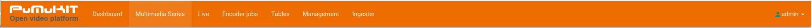

Figure 2. PuMuKIT Back-Office menu

### 1.3.1 PuMuKIT Back-Office URL

The URL to access the PuMuKIT back-office is:

(http://{MyPuMuKIT\_IP}/admin)

# 2 Series Management

One of the main modules of the PuMuKIT Back-Office is the Series Management module. This module is divided into 4 main areas: Series-listing, Preview of the selected series, filtering form and Metadata editing form for the selected series.

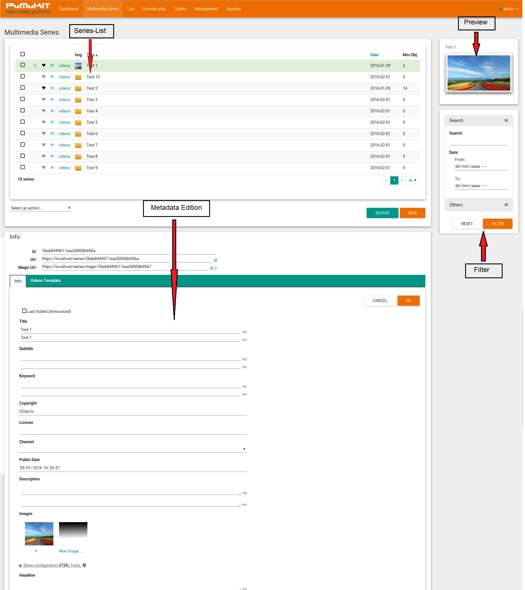

Figure 3. Series-List

## 2.1 Series-List

The Series-List is the main section of the interface and is made up of a table listing with a row per series.

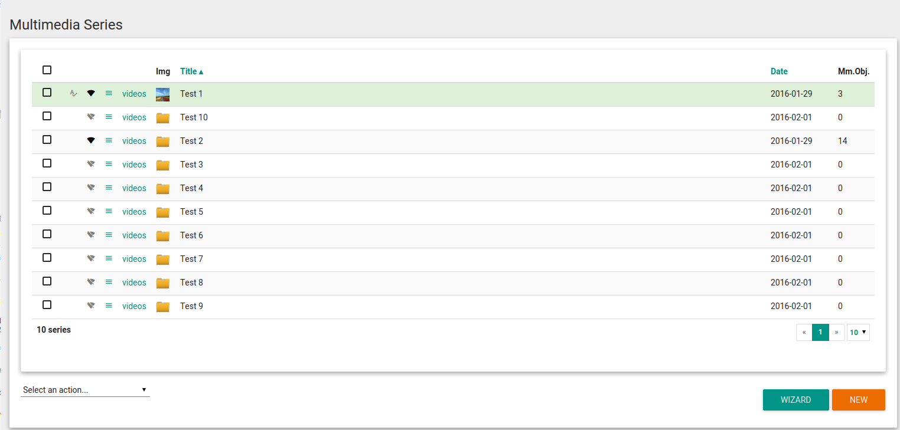

Figure 4. Series-List
              

The column names in the header of the table are links that you can use to rearrange the data of the listing in ascending or descending order for: the title of the series or the date of publication. To change this order, you simply have to click on the header of the column you want to sort your data with. If it's already sorted according to this column, data will be sorted in the opposite order.

### 2.1.1 Series-list main elements

On the Series-Listing area each row represents a series. In each of those rows you will find the following elements:

-   **Checkbox**: Used to select a series or group-operations (to delete several series at the same time, for instance).

-   **Announcement indicator**: A blue "A" indicates that the series itself is announced in the "Recently Added" area of the home page. A grey "A" indicates that the series has some multimedia objects that are announced in the same area of the home page. 

-   **Publication level icon**: The publication status of a series depends on the publication status of its multimedia objects and it is represented by this icon. By placing the mouse pointer over the icon, it is possible to see how many multimedia objects are Published, Blocked or Hidden inside the selected series. An example can be seen in the following figure. 

-   **Hamburger Icon**: Quick access to multiple Series-Management funtions:
     - List multimedia objects of the series: Provides access to the multimedia objects (videos) view for this series. You can also open the MO view by double clicking anywhere on the row of a series in the Series-List.

     - Modify all multimedia objects status: Modify the status of all multimedia objects in this series.

     - Modify all broadcast: Modify broadcast profile of all multimedia objects in this Series.

     - Delete series: Delete the series and all its multimedia objects. If the multimedia objects include Opencast videos, PuMuKIT will not delete those videos from the Opencast system. Just the linked PuMuKIT-MO (created in the import-process) will be deleted.

     - Show properties: Show the Series properties. The information of this field can be diverse and variable.

-   **Img**: A small picture representing the serie content.

-   **Title**: Title of the series.

-   **Date**: Date of publication of the series.

-   **Mm.Obj.**: Number of multimedia objects in the series.

## 2.2 Series Filter

Thanks to these filters, the number of the series on the Series-List area can be narrowed down to easily locate the wanted ones. Using the filter form, a filter based on the title or date can be set up. To optimize the size on the Series view screen, the filter form works as an accordion, which means it can be collapsed the "Search" filter forms if they are not going to be used. The filter‟s title field ignores accent marks and is case insensitive. There is also a wild
character "*" (meaning it matches any character, e.g. "n*a" would match "Noa", "nana" and "nigeria").
The option "Show empty series" shows all the series that do not have any multimedia objects.

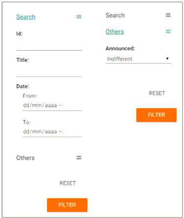

Figure 5. Multimedia series's filter-form

## 2.3 Series metadata edition

By selecting a multimedia series in the Series-list (clicking once in the series row), you will have access to its metadata editing form, below the Series-List area. The metadata editing form is divided into two tabs: "Metadata" and "Videos Metadata Template".
At the top of the metadata editing form there is an Metadata section which is showing the Id, the URL and the "Magic" URL of the Series:

-   ID: Unique identifier of the series.

-   Title: The title of the series.

-   URL: URL to the series in the public Video portal.

-   Magic URL: Special URL that gives access to all the MO of a series even if they are hidden. Useful when someone should review the MO before being published. You can send the "Magic URL" to the reviewer.

     - Refreshing Magic URLs: You can delete the Magic URL for a given series and create a new one with the "recycle" icon. That way people with the old Magic URL will not be able to obtain access to it anymore.

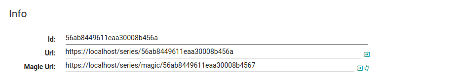

Figure 6. Multimedia series metadata section

### 2.3.1 Series Metadata tab (Metadata Edition)

By selecting this tab you will have access to the descriptive metadata (title, subtitle, etc...) and presentation metadata (thumbnail, HTML header and footer, etc...) of the series.

As it is shown in the picture below, the form has the identifier of the series you are modifying, as background image. 

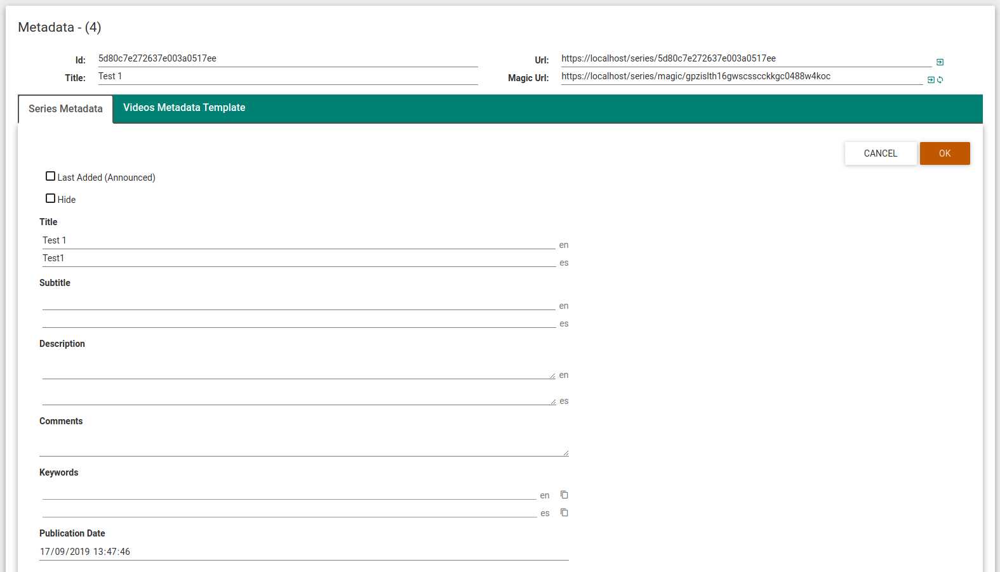

Figure 7. Multimedia series metadata editing form

You will find the following metadata fields in the form:

-   **Last Added checkbox**: If you select it, this series will be included in the "Recently Added" area of the video portal home page.

-   **Hide**: If this checkbox is marked, all the series info is hidden in the frontend but the published MO of the series are visible.

-   **Title**: It is used to define the title of the series and it is mandatory. Several title-fields are available for the different languages defined in the platform.

-   **Subtitle**: It is used to define the subtitle of the series, if it has one. Several subtitle-fields are available for the different languages defined in the platform.

-   **Description**: Include here a short description of the series. Several description-fields are available for the different languages defined in the platform.

-   **Keywords**: Include here any keywords for the series separated by semicolons. It is used to improve the efficiency of the searches.

-   **Publication Date**: It is initialized with the date of the creation of the series. It's easy to modify thanks to the calendar widget.

-   **Thumbnails**: One or more small images (thumbnails) related to the series. You can modify the order, delete or insert new ones. See section 3.3.

-   **HTML texts**: In these text boxes, you can add raw HTML content both to the header and footer of the series for decoration purposes.

-   **Headline**: Text that replaces the subtitle of the series when it is listed in the "Recently added" area of the video-portal homepage.

-   **Template**: It is used to choose the way of show the series videos in the portal.

-   **Sorting**: It is used to select the order of the series videos in the portal

### 2.3.2 Videos Template-Tab

It allows you to set a common metadata template for each new multimedia object created in that series. This is a very powerful tool that saves a lot of time in daily operation.

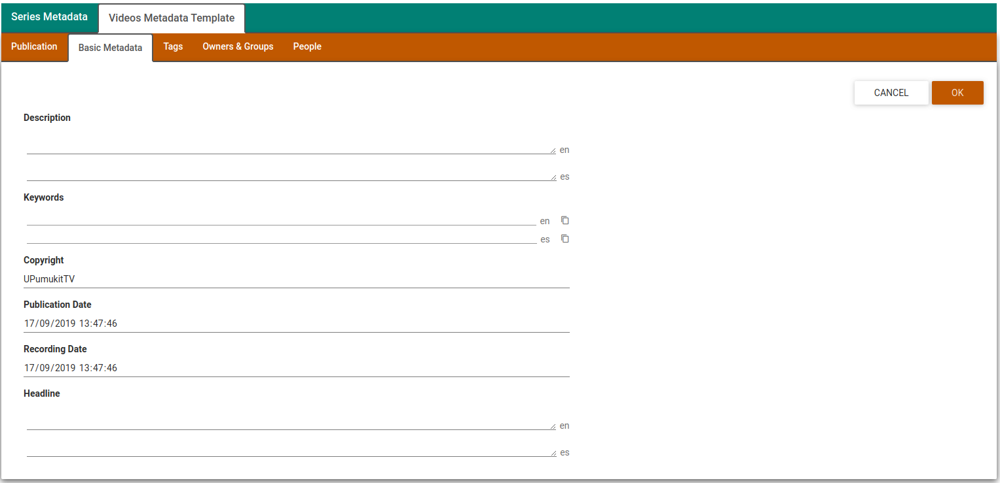

Figure 8. Default video metadata template

-   When creating or importing MOs to a series from Opencast, this default metadata will be assigned to each one of them. If the "Description" field is present in OC Metadata it will be kept and not overwritten.

 
# 3 Multimedia Objects Management 

This is a module to manage the multimedia-objects of a given series. Usually you will get access to this module by double.clicking a series row in the series management interface.The title of the series whose objects are being managed is displayed on the header of this page. In addition, there is a button that allows you to go back to the series-management module.

The user interface of this module is very similar to the series-management one. It is divided into the multimedia-objects listing area, the preview area and the metadata and media admin area. This module does not have a filtering form because generally a series does not hold a high number of multimedia objects and filtering is not necessary. 

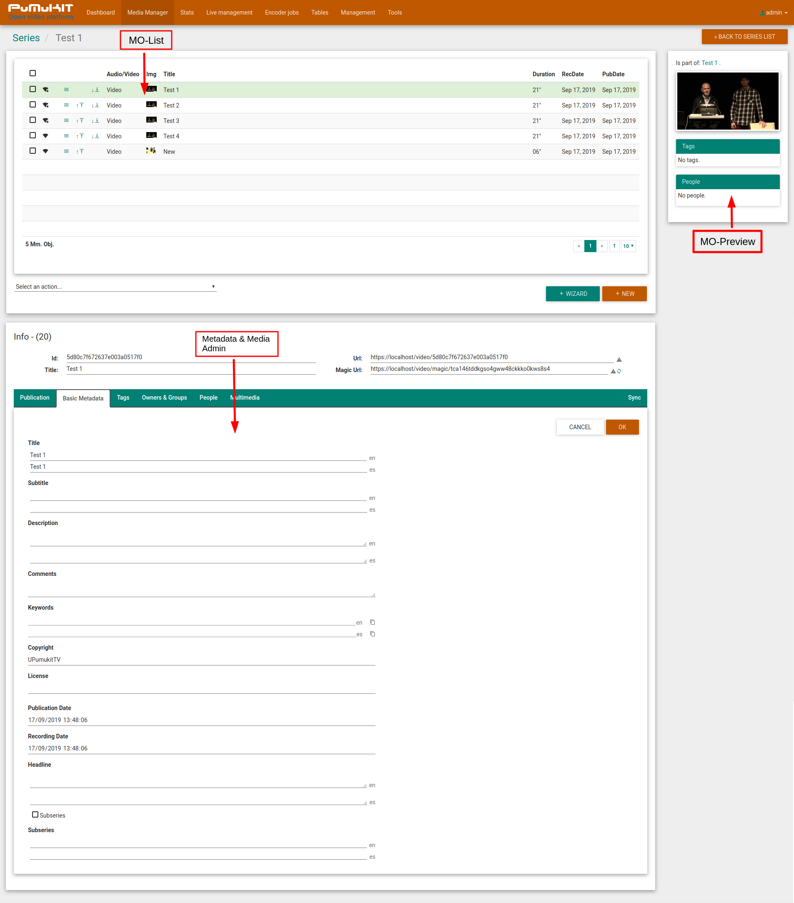

Figure 9. MO management module

When you click on an item of the MO-list, this MO will be selected, updating the preview and Metadata-editing area with this MO data. The preview area will show a video player and some metadata (tags, people...) of the MO. 

## 3.1 Multimedia object List area

The MO-List is the main part of this screen and is made up of a table with a row for each MO. The order of multimedia objects shown in this list will also be used to display the series in any publication channel (video-portal, iTunesU, etc...).

### 3.1.1 MO-list main elements

In the MO-List area each row represents a MO. In each of those rows you will find the following elements:

-   **Checkbox**: Used to select a MO for group-operations (to delete several MO at the same time, for instance).

-   **Publication Status icon**: Publication status of the multimedia object selected. By placing the mouse pointer over the icon, it is possible to see the publication status of the multimedia object. There are three possible status:
     - Published : The MO is listed in the Series and can be played with published URL.
     - Blocked : The MO cannot be accessed outside the back-end.
     - Hidden : The MO is not listed in the Series but can be played with magic URL.
     - Processing : The MO is generating its masters and/or delivery copies

-   **Hamburger Icon**: Quick access to multiple MO-Management functions.

     - **Delete MO**: Delete the MO. A recursive delete is performed, deleting all video files, materials (attachments) and images included in the MO. If the multimedia objects include Opencast videos, PuMuKIT will not delete those videos from the Opencast system, just the linked PuMuKIT-MO (created in the import-process) will be deleted.

     - **Add to playlist****: Add the selected MO to a playlist. This option is only available if Pumoodle bundle is installed.
     
     - **Clone MO**: (multimedia objects cloning) an intelligent cloning is performed and the same images and people are linked. Multimedia files are not copied.

     - **Show properties**: Show some Series properties. The information varies according to the MO origin. For example, if the MO has been imported from Opencast, the information will be related to Opencast (ID, URL, language, etc...). If the MO has been imported from Chaplin, then the information will be related to Chaplin (ID, Title, Author, Subtitle, etc...). And if the MO has been created in PuMuKIT, the information will be related to PuMuKIT (owner‟s id, subseries title, template option, etc...).
     
-   **Move up icon**: It moves the multimedia object up in the list. It is used to modify the order of multimedia objects in the series.

-   **Move down icon**: It moves the multimedia object down in the list. It is used to modify the order of multimedia objects in the series.

-   **Img**: Small picture that represents the multimedia object.

-   **Title**: Title of the multimedia object.

-   **Duration**: Video duration.

-   **RecDate**: Recording Date of the multimedia object.

-   **PubDate**: Publication date of the multimedia object.

Below this list, there is a **"+ wizard"** button. You can use this button to add new MOs to this series.

There is also a **"Select action"** box. This drop-down list allows you to delete or modify the state of several multimedia objects at a time by first selecting them using the checkbox at their left and then selecting an action from the drop-down list.

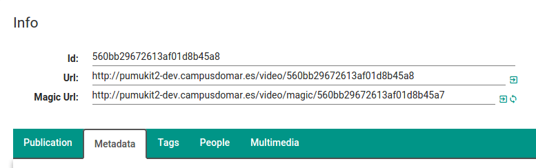

Figure 10. Multimedia object's info section

By selecting a MO in the MO-list (clicking once in the MO row), you will have access to its metadata editing form, below the MO-List area. The metadata editing form is divided into five tabs: "Publication", "Basic Metadata", "Tags", "Owners & Groups", "People", and "Multimedia (media files)" and Media Edition.

On the top of the metadata editing form there is an Info section which is showing the Id, the URL and the "Magic" URL of the MO:

-   ID: Unique identifier of the MO.

-   URL: URL to the MO page in the public Video portal.

-   Magic URL: Special URL that gives access to the MO even if it is hiden. Useful when someone should review the MO before being published. (You can send the "Magic URL" to the reviewer to give him private access to the video).

     - Refreshing Magic URLs: You can delete the Magic URL for a given MO and create a new one with the "recycle" icon. That way people with the old Magic URL will not be able to access to it anymore. 

## 3.2 Multimedia-object metadata edition

Selecting a multimedia object in the MO-list (clicking once on the row), you will have access to its metadata editing form, below the MO-List area. Since the multimedia object (MO) is the main part of the PuMuKIT database and holds lots of information, the Metadata & Media editing section is quite large. Therefore, it is divided into five tabs and as background image the ID of the multimedia object is shown. The tabs are: Publication, Metadada, Knowledge areas, People and Multimedia (media files).

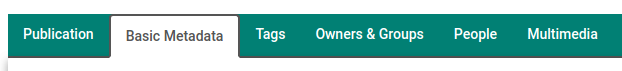

Figure 11. MO Metadata & Media tabs

### 3.2.1 Publication Tab

This first tab includes metadata related to the publication of a multimedia object.

-   **Status**: It indicates the Publication-state of a multimedia object. The possible publication-states of a MO are "Published", "Blocked" or "Hidden".  Publication-Status affects to all the Publication-Channels. You can select the "Blocked" status to temporarely un-publish a MO on all the channels, for instance.

-   **Publication channels**: a set of selectors that allow you to publish a multimedia object in the different online channels.

-   **Publishing decisions**: Set of selectors that allow to catalogue the multimedia object by globalizing it into one category as the frontend of the website is displayed. 

-   **Broadcast profile**: Through this, the access rights to the video can be modified. There are four different broadcasts available.
     - Public: Any internet user can play this multimedia object.
     - Password protected: Only users with the defined password can play this multimedia object. The password must be introduced twice. Use the button Show/Hide password to see the password and the Generate random password one to create a strong password.
     - Only logged in Users: Only logged in users in the system can play this multimedia object.
     - Only Users in Groups: Only users in the selected groups can play this multimedia object. As shown in figure 15, all the available groups are listed on the left. To add or remove groups from one list to another, double-click on the group name or select the group and click the corresponding arrow.

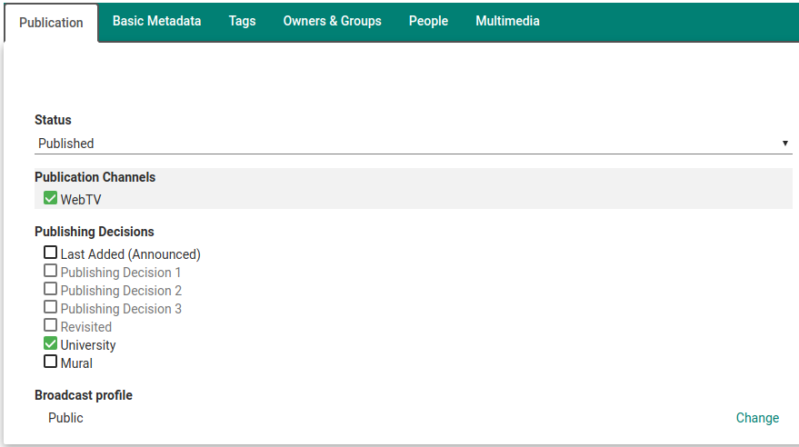

Figure 12. Multimedia objects publication tab

As you can see, there are different publication channels where you can publish multimedia objects. A multimedia object can be published in one or several channels like the internally generated Video-portal (WebTV), iTunesU RSS or YouTube. When a publication channel is selected, before publishing it, the file is automatically transcoded if required to match the specifications of the channel (MP4-H264 for iTunes, for instance) .The MO will not be published until this transcoding task is finished.

### 3.2.2 Basic Metadata Tab

This tab gives access to descriptive and presentation related metadata of the MO. The form in this tab includes the following fields:

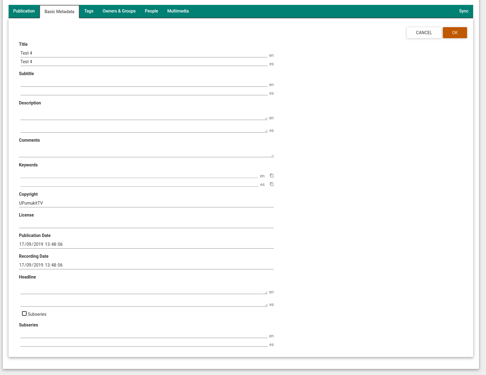

Figure 13. Metadata edition form

-   **Title**: It is used to define the title of the MO and it is mandatory. Several title-fields are available for the different languages defined in the platform.

-   **Subtitle**: It is used to define the subtitle of the MO if it has one. Several subtitle-fields are available for the different languages defined in the platform.

-   **Description**: Include here a short description of the MO. Several description-fields are available for the different languages defined in the platform. 

-   **Comments**: Internal notes about the MO. They are not shown in the frontend.

-   **Keywords**: Include here any keywords for the MO separated by semicolons. It is used to improve the efficiency of the searches.

-   **Copyright**: Field where the copyright of the MO is defined.

-   **License**: Text field for licensing information (Creative Commons-SA-BY, etc...).

-   **Publication date**: It is initialized with the date of the creation of the series. It's easy to modify using the calendar widget.

-   **Recording date**: Recording date of the multimedia object. It is initialized with the creation date of the multimedia object. Mandatory field.

-   **Headline**: Text that replaces the subtitle of a MO when it is listed in the "Recently added" area of the video-portal homepage.

### 3.2.3 Tags

The "Tags" tab allows you to catalogue a multimedia object in the defined knowledge categories. Knowledge areas (KA) are divided in "domains". A MO can be catalogued in one or several domains. A MO can be catalogued in more than one knowledge area at the same time for each domain.

In this user interface, for each "domain" you will see 2 areas:

-   Knowledge areas list (right box): lists all the tags available.

-   Knowledge areas selected (left one): lists the selected tags for this MO.

If you want to catalogue a multimedia object (MO) in a specific area, you just have to select it in the listing on the right and click on the arrow to include it in the left listing. If you want to remove a KA tag from a multimedia object then you have to do the opposite.

#### 3.2.3.1 Sync KA tags button

In the upper right corner of this tab you can see the button "SYNC IN THIS SERIES". By clicking on this button the KA tags of all the MO the Series will be substituted by the current KA tags of this object. This is another way to tag all the multimedia objects of a Series at once.

#### 3.2.3.2 Default KA tags

If the KA tags of all the MO of a series are going to be the same, you can modify the default "Video Template" of the Series (Section 2.3.2) specially the default "Tags-Tab" for that series (this is especially helpful when importing Opencast recordings). Doing that, every new multimedia object of the series will have these KA tags set by default when it is created.

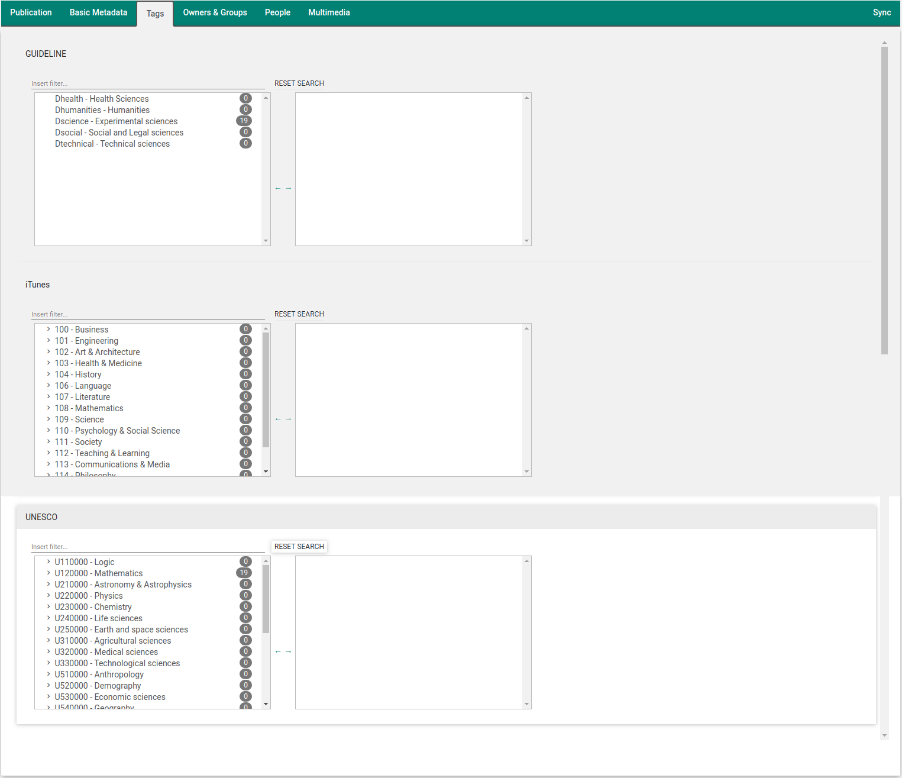

Figure 14. Multimedia object's areas tab

### 3.2.4 Owners & Groups

In this tab there are two sections: Owners and Admin Groups.

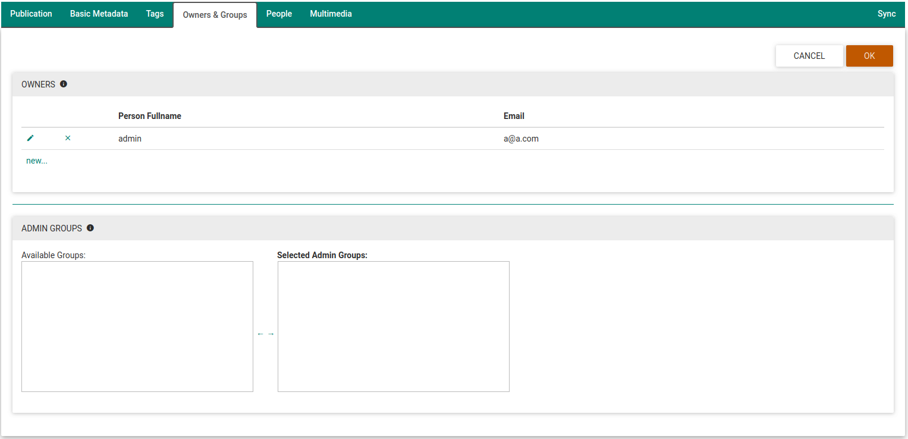

Figure 15. Multimedia object’s owners & groups tab

##### 3.2.4.1 Owners 

Users that can admin the multimedia object (or the series). The following options are available in this section:

-   **Delete owner**: Click X icon to delete the selected owner.
-   **Add new owner**: Click NEW to add a new owner. A form like the one in figure X will open and the following options will be available:
     - ***Search people***: Write the name of people you wish to add; while you start typing the name, you will see a list of people already in the database with a name matching the written characters. For example, after typing "Juan" you will see listed all "Juan" in the database and after typing «Juan go» you will only see listed those people named "Juan" and with a surname starting with "go" as González or Gómez.
     - ***Create people***: Create new people in the database by clicking in the NEW button. A new form (figure 19) will open where you can finish filling the relevant data for that person. Once you are done the person will be created and linked to the multimedia object. You have to be careful with the position (Post field in the form) you give to the people because it‟s not the same Rubén González as a student or as a programmer. A person in PuMuKIT is a combination of name and position (which means you can "duplicate" a person if their position changes).
-   **Edit owner: Click "pencil" icon to edit the selected owner. The same form as the one in figure 21 will open. All fields can be changed but be careful if it is not your user.

#### 3.2.4.2 Admin Groups

A Group is a set of users that can administrate the selected multimedia objects or series. Only the admin users can create groups and add other users to it.
However, through this tab a Publisher user can select which group can admin a multimedia object (or a series). To know more about the Groups module, see
Galicaster Media Server-System Admin Guide. 

Adding a group as an Admin Group means that all users in the group can reproduce it in the publication channel selected. Moreover, those ones with a Permission Profile different than Viewer will see the selected MO in the back- office and will be able to edit its characteristics.
There are two columns the one on the left with all available groups in the system and the one on the right with the selected admin groups.

There are two ways to add/remove groups from one column to another. By double clicking on the desired group or by selecting the desired group and then
clicking the corresponding arrow (the right one to add and the left one to remove). These actions should be done in the left column to add admin groups and in the right column to remove them.

### 3.2.5 People

In this tab you can include people related to the MO in different roles. It is divided in blocks, each one corresponding to the different roles that a person can have related to a video (actor, organizer, producer...). You can modify the order of the people listed in each role with the arrows in the list. You can also edit the attributes of the people, without using the "people module". In addition, you can remove a person from the multimedia object. (NOTE: If you remove a person that is not related to another multimedia object, you will be deleting him/her from the database). Using the "new" button, you can add a new person to the MO while creating it in the database or add an already existing person to the object.

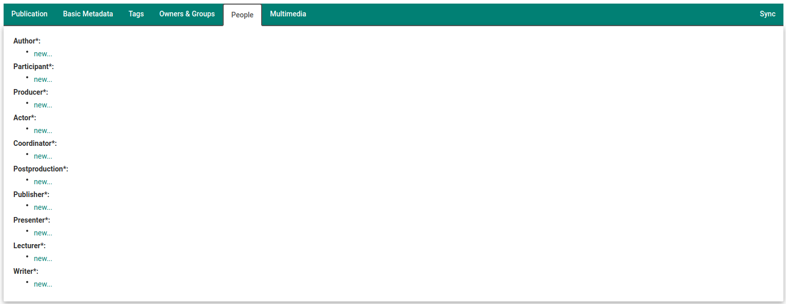

Figure 16. Multimedia object’s people tab

### 3.2.6 Multimedia tab

This tab gives you access to the MO media files (the essence of the digital object), and also to other attached files. It is formed by four areas:

-   **Thumbnails**: A list of thumbnails or small images linked to the multimedia object. You can modify its order, delete them or insert new images. See section 3.3.

-   **Video files**: List of media files of the multimedia object. You can upload new "master" video files, modify, arrange, preview or delete them.

-   **Materials**: List of additional files (attachments) of the multimedia objects (PowerPoint files, PDFs...). You can create new ones, modify, arrange or delete them.

-   **Links**: List of URLs related to the multimedia object. You can create new ones, modify, arrange or delete them.

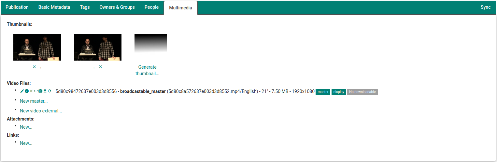

Figure 17. Multimedia object’s multimedia tab

## 3.3 Series and multimedia object thumbnails module

This module is used by the series-module and the MO-module to list thumbnail images linked to the different MO or series. It also allows you to link new images.

Both series and multimedia objects have a certain number of representative thumbnails assigned, mainly obtained from a frame of the video or the logo of the event.

### 3.3.1 Linking a thumbnail picture to an object (Series or MO)

There are two different ways to link a thumbnail picture to a MO or Series:

-   **Uploading a local image**: You can upload an image file from your local hard drive. The image will be resized by the PuMuKIT server to save space and optimize page loading speed.

-   **Using an existing image**: The last used images are listed in pages so you could reuse them. You can advance through the different pages with the "previous" and "next" buttons.

These two methods to link images correspond to the two areas of the thumbnail management form.

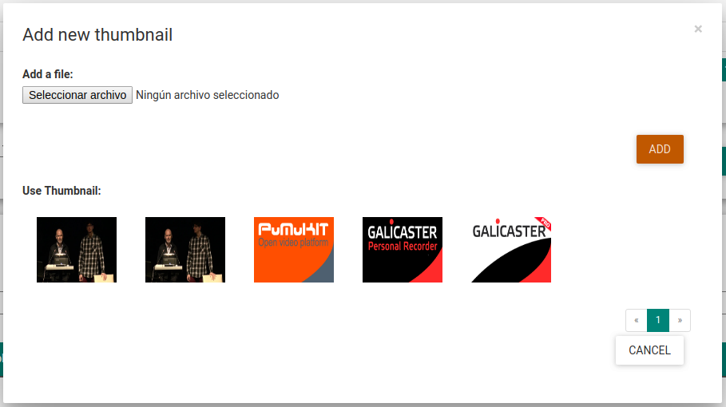

Figure 18. Thumbnail management form

After linking one or more Thumbnails to a MO or series using this module, you will be able to see those linked thumbnails in the Multimedia-Tab of the referred object:

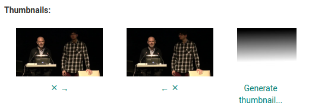

Figure 19. Thumbnails in the Multimedia-Tab of a MO

A thumbnail can be linked to more than a multimedia object. If a thumbnail image is removed from an item, but it is linked to another one, it is not deleted. If it is only linked to an item and the link is removed the image will be deleted.

In the MO management module, the new thumbnail can be posted in two different ways:

-   If the content of the multimedia object is a video, you can extract a thumbnail from the video frames. Using the "Photo" button, an image will be extracted at the selected instant of the video.

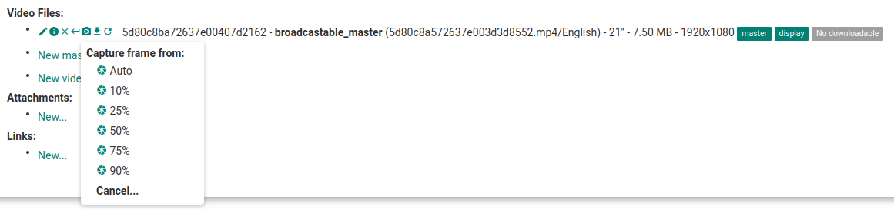

Figure 20. Photo tool (Frame Capture tool)

-   The thumbnail can be uploaded to the server from your computer by clicking on "New Image". These images are resized on the server to optimize space and reduce the bandwidth needed to display the portal.

## 3.4 UNESCO Catalogue view

This view shows the MOs catalogued in the UNESCO tags. It has also an advanced viewer that allows search by all the fields of MO metadata.

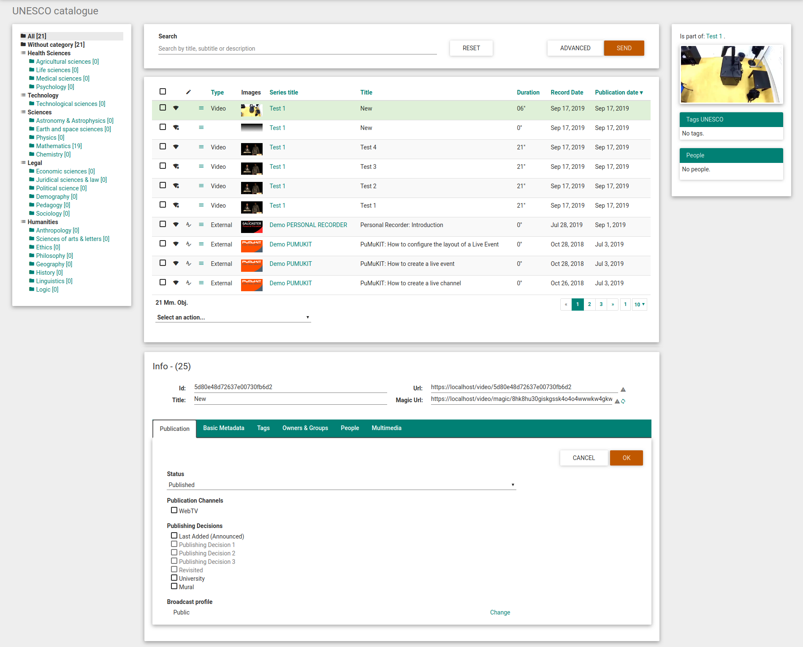

Figure 21. UNESCO catalogue view

In the left menu you can Access to all the UNESCO tags and clicking in a tag you can see all the catalogued videos of that tag.
There are two filter options in this view, the normal search where you can search by title, subtitle or description:

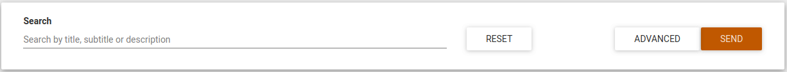

Figure 22. Normal search filter

And the advanced search where you can search by all the available fields of MOs:

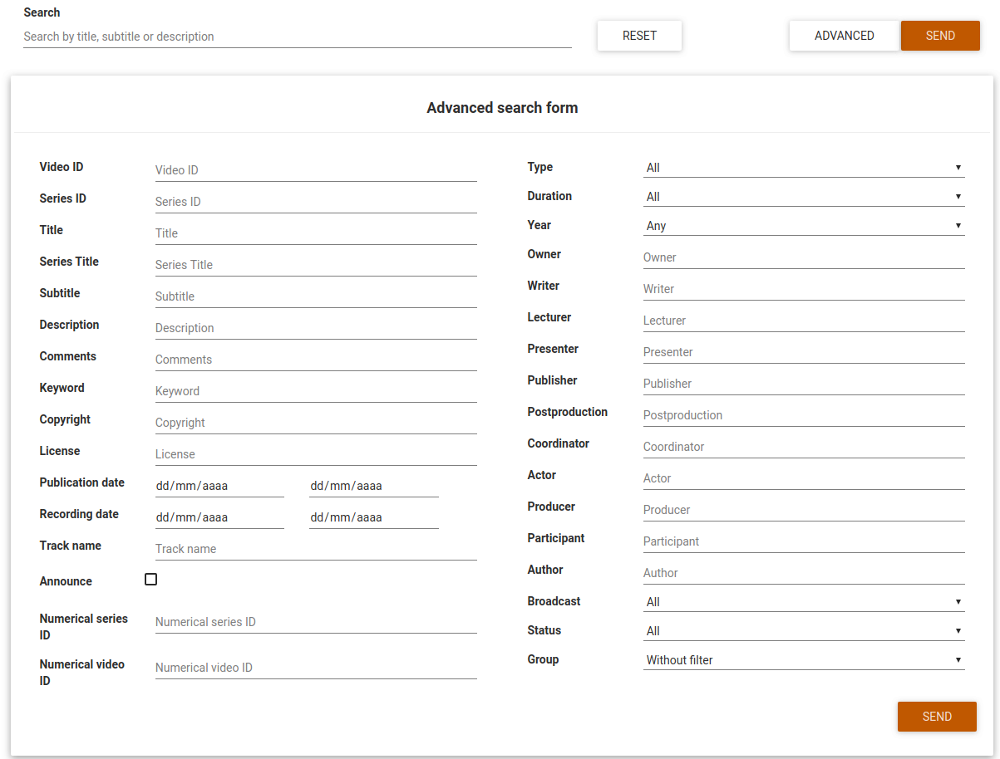

Figure 23. Advanced Search filter

It is possible to edit all the fields of a selected MO in this section, just like in the MO view.

# 4 Ingesting and importing content

## 4.1 Ingesting "mono-stream" content (regular videos)

Multimedia objects and series are created using the "Multimedia series" module. From the PuMuKIT-Backoffice to automate the process there is a wizard that will guide you through the steps of the creation and cataloging of mono-stream content. You can launch the Ingest-Wizard from the Series Management or the MO Management module.

### 4.1.1 Running the Ingest-wizard

The wizard will launch after clicking the button "Wizard", as shown in the picture below:

Figure 24. Wizard button

This Ingest-wizard  is composed of four steps:

-   **STEP I**: The wizard will show you a pop-up window to choose one or several multimedia objects: In this step, you can choose to upload one single multimedia
object or a group of them to the series.

    
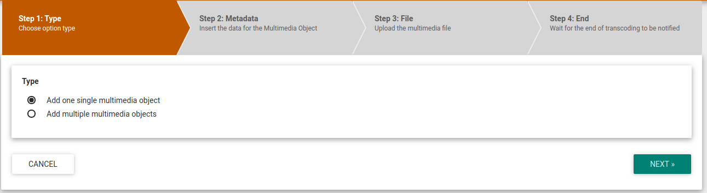

Figure 25. Wizard Step I

-   **STEP II**: Basic MO metadata: A second window will be shown to complete the title, subtitle, description and headline of the new multimedia object.This step will not be displayed if you select "Add multiple multimedia objects" in the previous step.

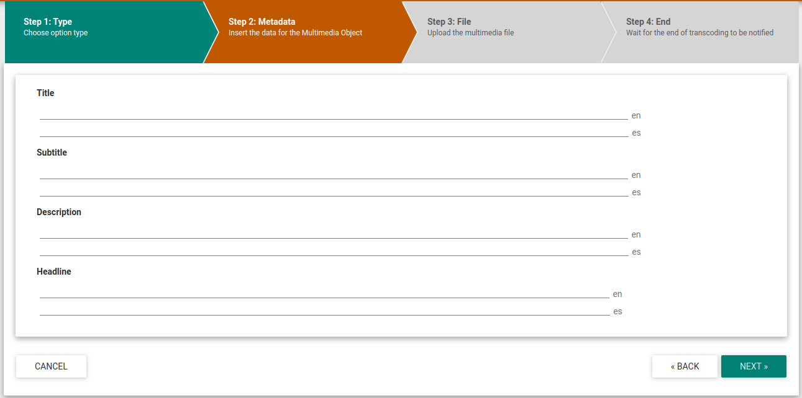

Figure 26. Wizard Step II

-   **STEP III**: Technical Metadata and Media uploading: Finally, a third window will be shown to complete technical metadata about the publication and processing. It will be possible as well to select the video that will be uploaded. The fields to complete are:

    -   **Master**: Defines the quality of the master video you will store.You can store a direct copy of the ingested video choosing "master_copy" or a compressed copy by choosing "master_h264".

    -   **Publication Channels**: Multimedia channels where newly created object will be published: Web TV.

    -   **Priority**: Priority of transcoding. It is used to set the priority of the video in the transcode queue.

    -   **Language**: Language spoken in the video.

    -   **Mode**: The way the media file will be uploaded to the new multimedia object. It may be:
    
       - **Local Hard Drive**: To upload a file stored in the user's computer.
       
       - **Inbox on Server**:  To select a single file stored the server file folder.

       - **Audio/video file:**: Field used to select the local media file or server directory.

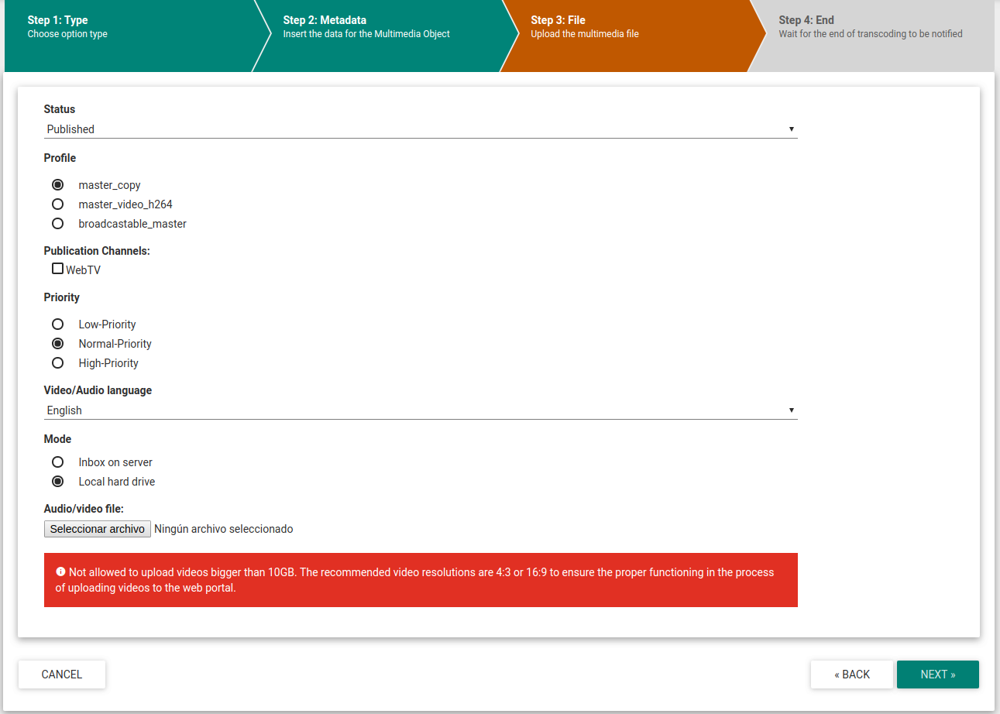

Figure 27. Wizard Step IV

-   **FINAL STEP**: This window shows the result of the wizard and it allows you to choose several new actions:

    -   Review the created Multimedia Object data.

    -   Create another Multimedia Object in same Series.

    -   Create another Multimedia Object in a new Series.

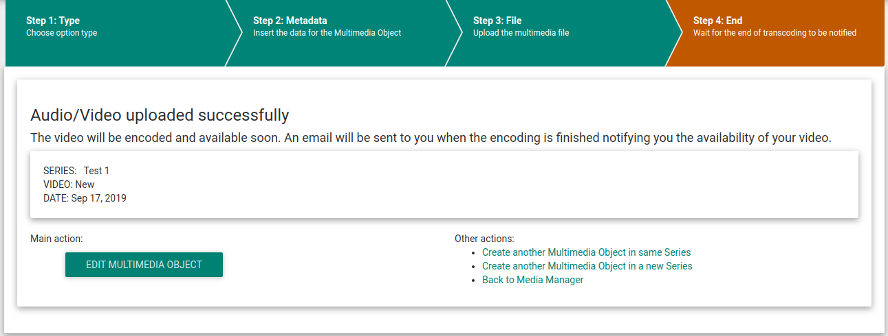

Figure 28. Wizard Final Step

After completing the steps of the Ingest-wizard, the multimedia object with the specified metadata will be created and the uploaded video file transcoded and catalogued. When the media process finishes you will see the media ready in the "Multimedia" tab ("Video Files" block) of the newly created MO.

The upload process automatically generates a thumbnail-image for the multimedia object by capturing a frame of the video. It is recommended to review it and capture another manually, if required. The thumbnail-image for the series must be manually selected (See section 3.3).

# 5 Statistics

The Statistics module is a module where you can monitor the number of viewings of multimedia objects and series published.

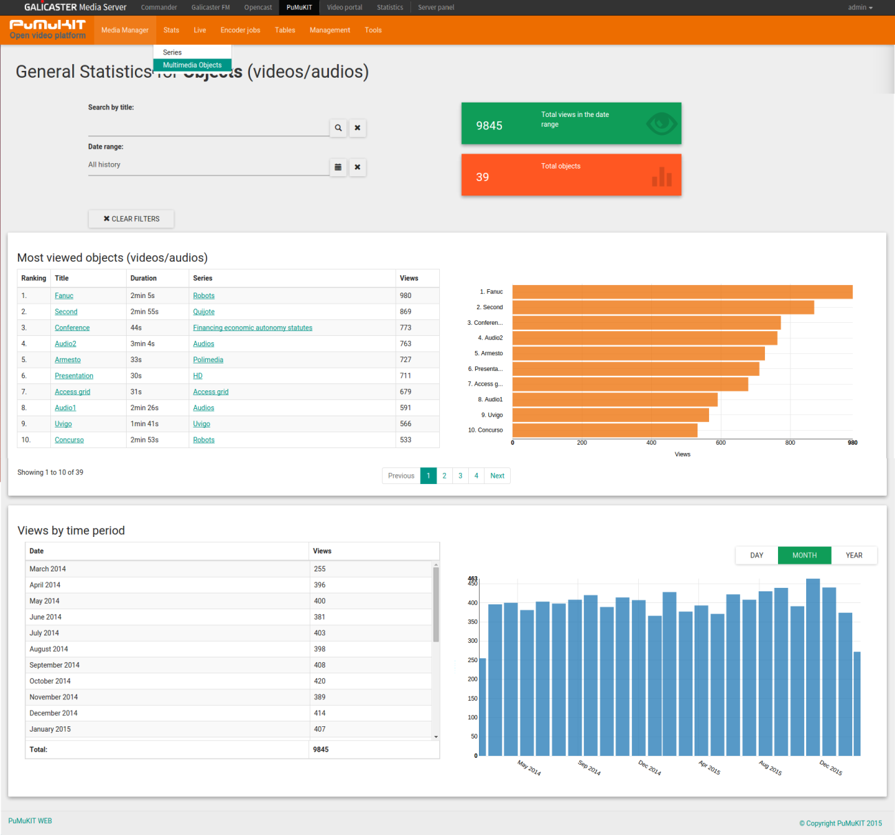

Figure 29. Statistics tab

The Statistics window has two main views:

-   **Multimedia Objects**: In this view, you can check the statistics for all the multimedia objects in PuMuKIT.
-   **Series**: In this view, you can check the statistics for all series in PuMuKIT. The number of views of a series is the sum of the number of views for all the multimedia objects belonging to that series.

To the right of the search parameters there are two info boxes; the orange box indicates the total number of multimedia objects or series found for your search parameters and the green box shows the total number of views for all these objects during the date range you selected.

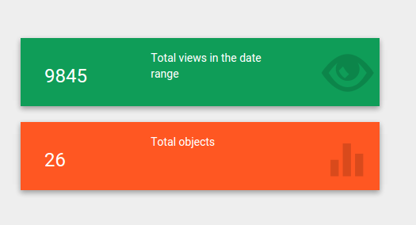

Figure 30. Info box

## 5.1 Series and objects search filter

Thanks to this filter, you can narrow down results and easily locate the series or objects you are looking for. This search filter allows you to execute searches based on the title and date range.

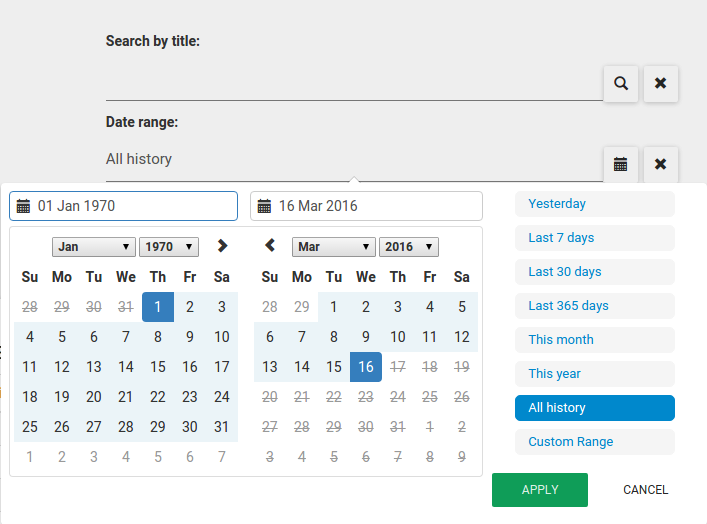

Figure 31. Series and objects search-form

## 5.2 Most Viewed

In this field the ranking of the most viewed series and objects are shown. This ranking is displayed through a ranking list at the left and a corresponding bar graph at the right.

-   **Clicking on a series** on this list will bring you to the statistics for that series, where the statistics for all the multimedia objects belonging to that series will be displayed.
-   **Clicking on a multimedia object** on this list will bring you to the statistics for that object, displaying a thumbnail through which you can access that object's video player on the Video Portal.

## 5.3 Views by time period

In this field you will see the total number of views, between the data ranges you previously selected (if any), grouped by periods of time for all the objects or series shown at that moment in the statistics module.

These views can be grouped by day, month (by default) or year. You can change the grouping criteria by clicking on the corresponding button at the top-right corner of the "Views by time period" display.

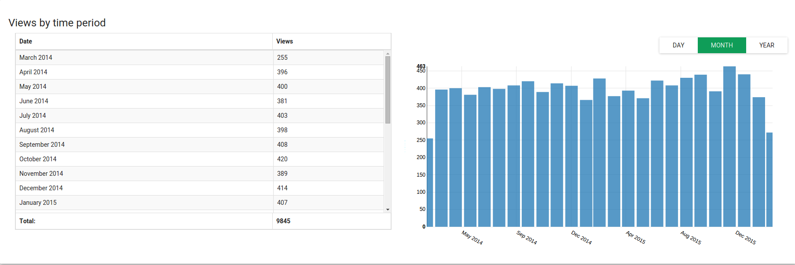

Figure 32. Views by time period

# 6 Live Streaming

The "Live Management" module allows you to manage the live streaming channels of the PuMuKIT video-portal. It is divided in two different "tools", the Channel configuration and the Live Events.

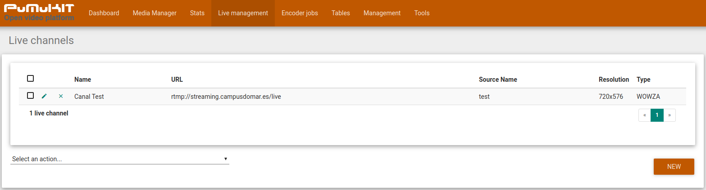

Figure 33. Live channels view

## 6.1 Live channel module

The Live channels module can be configured using the following parameters:

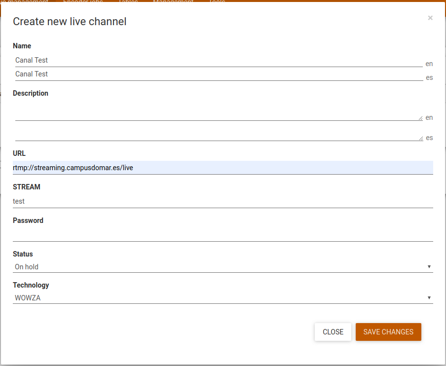

Figure 34. Live channel edition form

-   **Name**: Live channel name shown in the frontend.

-   **Description**: Information about the channel.

-   **Status**: There are two possible states for the channel:

     - Live broadcasting: Enables live streaming on the channel.
     
     - On Hold: Disables live streaming on the channel. It can be configured to play videos (waiting playlist) while there is not any live streaming being published on the channel.

       **NOTE**: When the live streaming source is not available it is recommended to change the channel state to "On hold".

-   **URL**: Streaming server's URL. You can only use RTMP based urls. We recommend using the AMS technology (Adobe Media Server) because it can deliver live streaming content to both desktop and mobile devices. The URL by default is rtmp://<URL>/livepkgr .

      PuMuKIT also supports FMS technology (Flash Media Server).

-   **Technology**: It supports FMS technology (Flash Media Server) and WMS technology (Windows Media Services). To use AMS technology chooses FMS. AMS is the new version of FMS that is able to deliver multimedia content to mobile devices as well.

-   **STREAM**: Name that identifies the video flow on the streaming server.

## 6.2 Streaming encoder configuration

The streaming encoder delivers multimedia content to the streaming server. The streaming server relays the multimedia content to the users desktop computers or mobile device. We recommend Adobe Media Server (AMS) as Pumukit live streaming server.

As streaming encoders, Adobe Flash Media Live Encoder (FME), Wirecast and other applications can be used.

Streaming encoder configuration recommendations for AMS:

-   Select AMS technology.

-   Select H.264 video codec with the following parameters:

     - Profile: Main
     
     - Level: 4.1
     
     - KeyframeFrecuency: 4 seconds
     
-   Select AAC audio codec if available. AAC format is fully compatible with desktop computers, Android and iOS devices. Mp3 format at 44100 Hz sample rate can also be used but it might have problems with older devices (iPad 1). 

## 6.3 Advanced Live events module

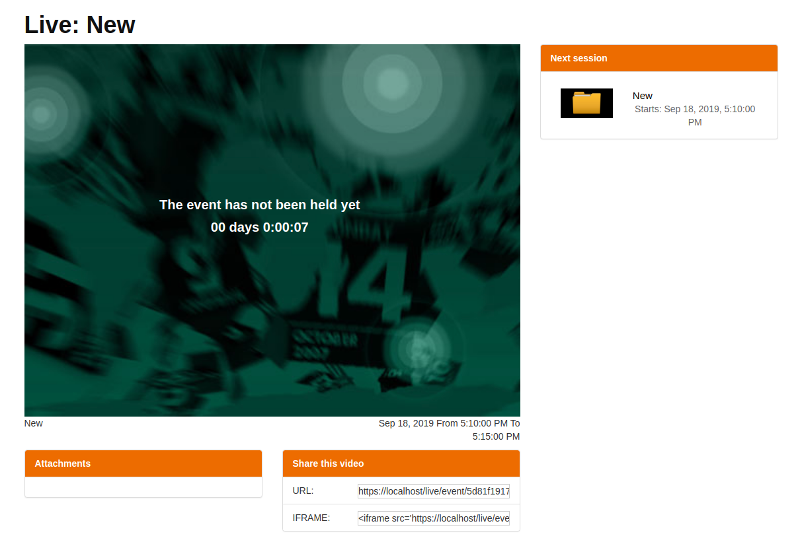

Figure 35. Announcement of live event

With this configuration it is possible create personalized live events. These events can broadcast separated in different sessions and the show a countdown previously to the event.
Moreover the events can be related with the series that saves the recording of that event.
Once all the sessions of an event are finished, the event url will be redirect to the related series if the series has MO published.

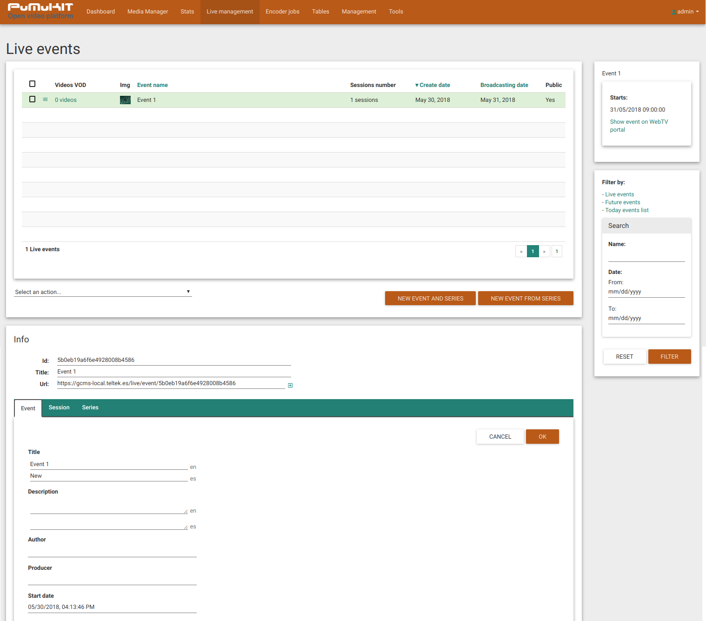

Figure 36. Advanced Live Events View

There are two possible options to create new events:

-   New event and series: Clicking on this option, a new direct event and a new related series are created.
-   New event from series: A new event is created from a selected series (previously created).

Next, we detailed the configuration options of an event:

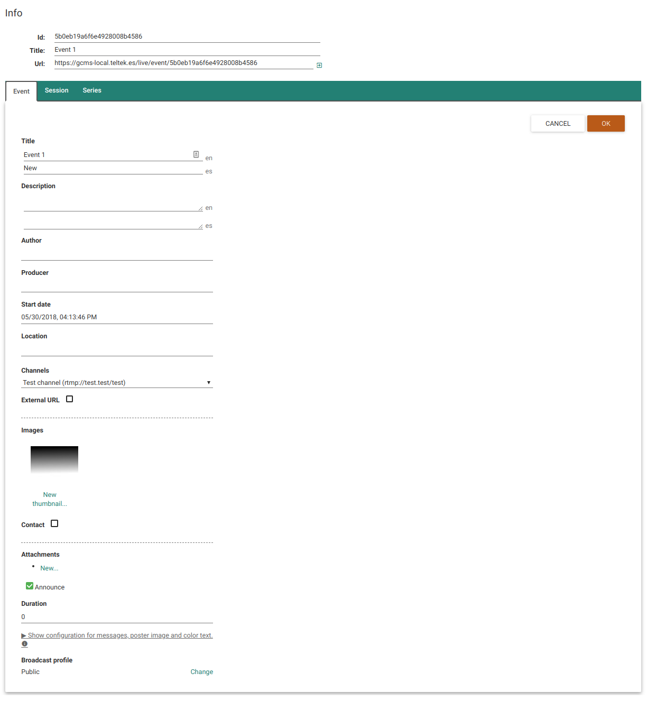

Figure 37. Event configuration tab

-   Title: Title of the event.
-   Description: A summary of the event.
-   Author: Person that creates the event.
-   Producer: Person that produces the event.
-   Location: Place where the event happens
-   Channels: Select a previously configured channel where broadcasts the live event.
-   External URL: Activate this checkbox to use a video or a external server URL to broadcast. Then write the desired URL in the next line, and it will be used instead of the selected channel.
-   Images: Image that the event has in the frontend preview
-   Announce: Active the checkbox to announce the celebration of the event in the frontend. If it is not activated, only people that know the URL can access to the event.
-   Broadcast profile: Select if the live event is public or protected by password.
-   Show configuration for messages, poster image and color text: Clicking on this option you can configure the image and the text showed in the player previously to the event. You can find the next options:
     - Already held event message: The message shown in the player when the event is finished.
     - Not yet held event message: Message shown in the player previously to the event starts.
     - Event poster: Image shown in the player previously and after the event.
     - Poster text color: Select the text color to the messages.

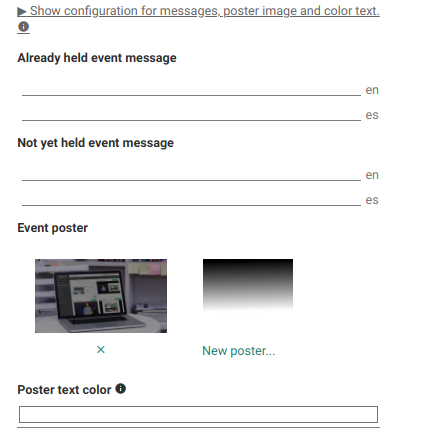

Figure 38. Poster configuration options

Once the event is configured in necessary create the sessions of that event. Click on the Session tab can see the next options.

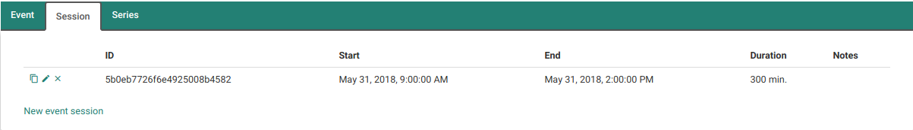

Figure 39. Session configuration tab

To create a new session simply click on "New event session" and the time of the session can be configured.

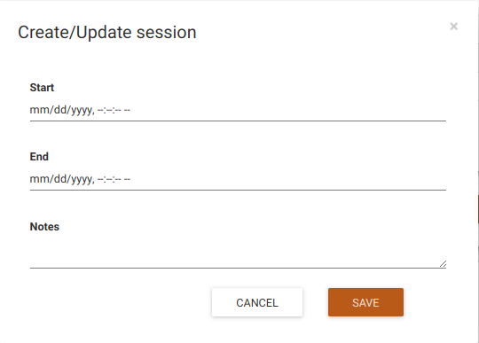

Figure 40. Session configure options

In the series tab the metadata of the related series can be edited. If you change some parameters, these will change in the created series.

In this module there is also a search filter to facilitate find the events by name, date or a predefined filters:

- Live events: Events that are broadcasting now
- Future events: Events that have sessions to broadcast in the future
- Today events list: Events that have sessions today

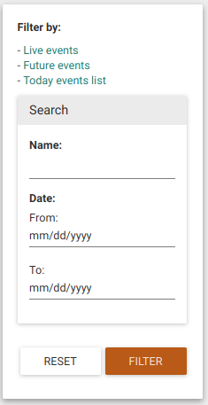

Figure 41. Search filter in events module

# 7 System management modules

PuMuKIT's Back-office has other modules to perform less common system management tasks. In this section, the different admin existing modules will be summarized just for informational proposes. 

## 7.1 Encoder jobs module

It is a module that summarizes transcoding jobs: those in progress, those pending for transcoding and those finished (both correctly and incorrectly).

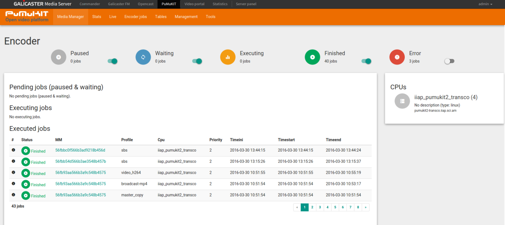

Figure 42. Encoder jobs module

## 7.2 Admin users module

Using this module you can configure users who have access to the administration application. Through this module, you can create, edit and delete users.

There are five user types:

-   **Administrator**: Has full access to the platform.

-   **Publisher**: This person is the content administrator of the platform. It has access to all the modules except the "Management" menu. (Including Admin users, Groups, Permission Profiles editing and Roles editing).

-   **Ingestor**: Users that mainly upload and catalog content in the platform. They can not publish new videos, (a Publisher should do after reviewing the ingested content) they only have restricted access to manage the multimedia content in the back office. It does not have access to the "Management" menu (as before), it cannot access the tags and series types Tables. It cannot change the multimedia object status. It can only upload videos through the Wizard or through the OC-Importer.

-   **Autopublisher**: They are users that can manage only their own multimedia content. This Permission-profile can be used for Professors and instructors. It has the same restrictions as the "Ingestor". It cannot access the "Live" menu (live channels and events). It cannot access the OC-Importer. It only has access to the series and multimedia objects he creates ("Owner" role) or he can manage ("Admin Groups").

-   **Viewer**: Users that only has authenticated access to video portal so they can watch videos restricted to authenticated users. They can not access to PuMuKIT back office.

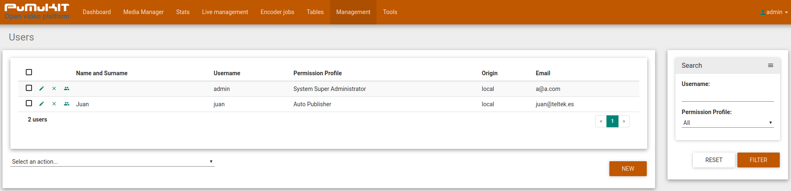

Figure 43. Admin user module

## 7.3 Roles module

It is a module that allows you to manage roles with people linked to multimedia objects. These roles can be as follows:

-   **Public**: these are shown to everybody through the feeds and the Web portal.

-   **Private**: these are used internally to manage and catalogue multimedia objects in a better way. They are not shown in the Web portal.

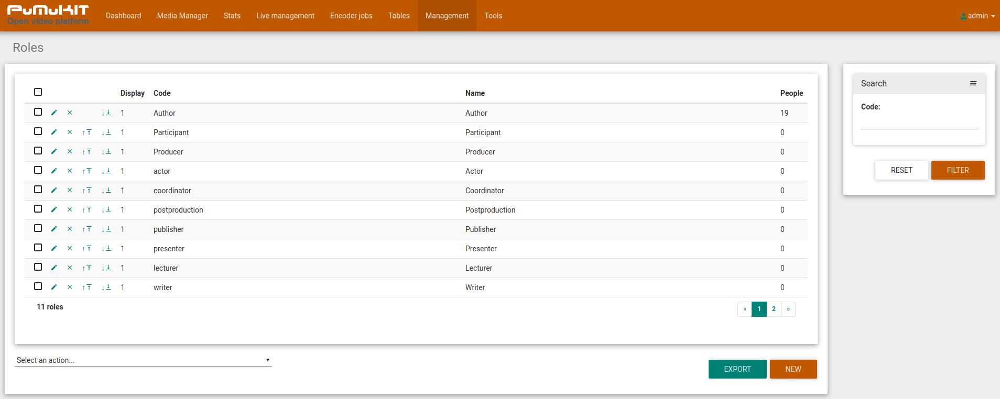

Figure 44. Roles module

# 8 Other management modules

PuMuKIT's Back-office also has other modules to perform less common management tasks. In this section, the different admin existing modules will be summarized. 

## 8.1 Dashboard module

It is a module created with a set of tools that allows you to see a summary of the server state: last published videos, last created videos, portal information, disk usage, transcoding usage...

Figure 45. Dashboard module

## 8.2 Tables module

### 8.2.1 People table

It is a module to manage people data linked to a multimedia object, whether they present a lecture, they are short-film actors or they have a much more tecnichal role as producers, directors, etc... People are linked to the multimedia object through the roles that are managed in the corresponding module by an Administrator user.

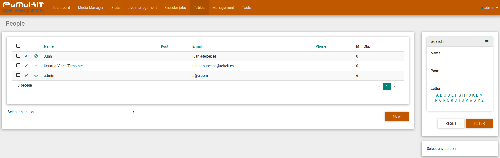

Figure 46. People module

This module allows the creation, edition and removal of information related to people. It should also be noted that each entry is a combination of a person and its "position" (professor, chancellor, etc...) so a person with two different positions will have two different entries. This makes easier to solve issues with temporary positions as Chancellor of the Univerity. This particular person will have two entries: one as chancellor and another as professor. 

### 8.2.2 Tags table

This is a module that allows you to manage Tags areas used to catalogue multimedia objects. 

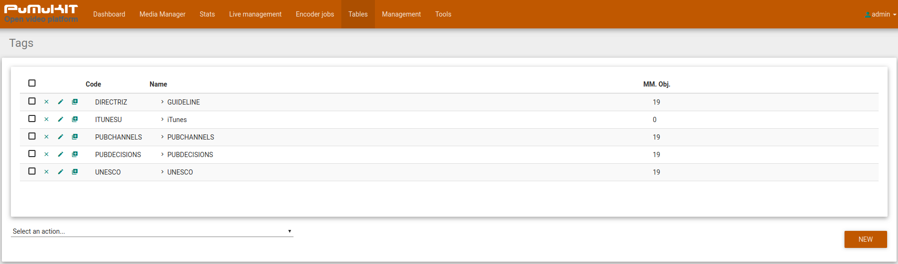

Figure 47. Areas ok knowledge module

Different Knowledge Areas (KA) "types" or taxonomies can be managed in PuMuKIT. A KA "type" can be the UNESCO schema, etc... or even a custom designed one (based on the departments of your institution, etc...). Moreover, you can create relationships among areas to make recommendations when a multimedia object is catalogued in a specific area.

