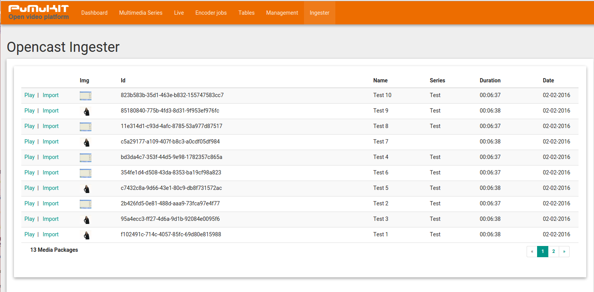
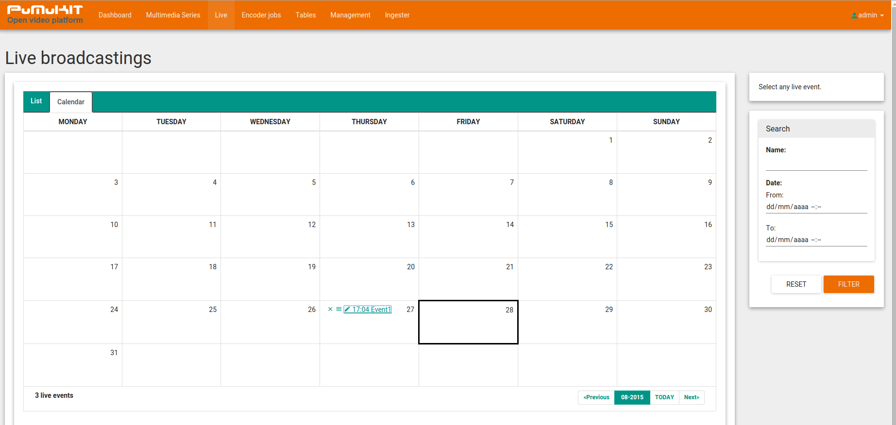
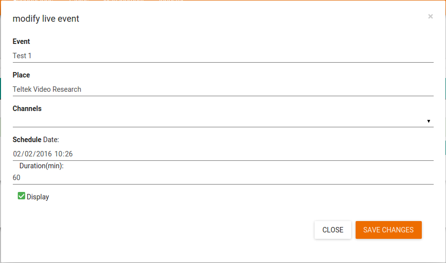
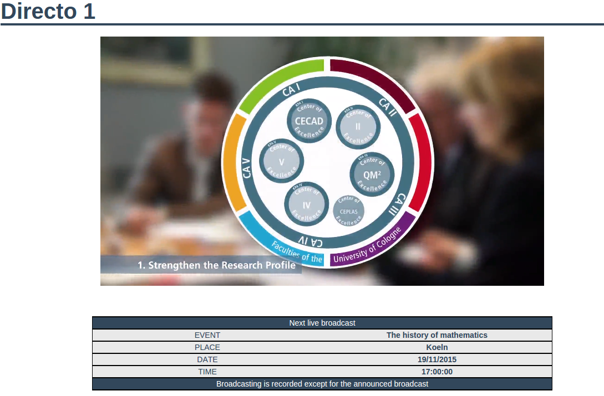

PuMuKIT-2 User Guide
====================

*This page is updated to the PuMuKIT 2.1.0 version*

# PuMuKIT Content Manager Manual

## Table of contents

1. [General Overview](#1--general-overview)

  1.1 [Terminology](#11--terminology)
  
  1.2 [PuMuKIT Overview](#12-pumukit-overview)
  
  1.2.1 [Multimedia Objects and Series](#121-multimedia-objects-and-series)
  
  1.3 [PuMuKIT Back-Office](#13-pumukit-back-office)
  
  1.3.1 [PuMuKIT Back-Office URL](#131-pumukit-back-office-url)
  
2. [Series Management](#2-series-management)

  2.1 [Series-List](#21-series-list)
  
  2.1.1 [Series-list main elements](#211-series-list-main-elements)
  
  2.2 [Series Filter](#22-series-filter)
  
  2.3 [Series metadata edition](#23-series-metadata-edition)
  
  2.3.1 [Info-tab (Metadata form)](#231-info-tab-metadata-form)
  
  2.3.2 [Videos Template-Tab](#232-videos-template-tab)
  
3. [Multimedia Objects Management](#3-multimedia-objects-management)

  3.1 [Multimedia object List area](#31-multimedia-object-list-area)
  
  3.1.1 [MO-list main elements](#311-mo-list-main-elements)
  
  3.2 [Multimedia-object metadata edition](#32-multimedia-object-metadata-edition)
  
  3.2.1 [Publication Tab](#321-publication-tab)
  
  3.2.2 [Metadata Tab](#322-metadata-tab)
  
  3.2.3 [Tags](#323-tags)
  
  3.2.3.1 [Sync KA tags button](#3231-sync-ka-tags-button)
  
  3.2.3.2 [Default KA tags](#3232-default-ka-tags)
  
  3.2.4 [People](#324-people)
  
  3.2.5 [Multimedia tab](#325-multimedia-tab)
  
  3.3 [Series and multimedia object thumbnails module](#33-series-and-multimedia-object-thumbnails-module)
  
  3.3.1 [Linking a thumbnail picture to an object (Series or   	MO)](#331-linking-a-thumbnail-picture-to-an-object-series-or-mo)
  
4. [Ingesting and importing content](#4-ingesting-and-importing-content)

  4.1 [Ingesting "mono-stream" content (regular videos)](#41-ingesting-mono-stream-content-regular-videos)
  
  4.1.1 [Running the Ingest-wizard](#411-running-the-ingest-wizard)
  
  4.2 [Importing videos from Opencast](#42-importing-videos-from-opencast)
  
  4.2.1 [First video of a series](#421-first-video-of-a-series)
  
  4.2.2 [Additional videos of a series](#422-additional-videos-of-a-series)
  
  4.2.3 [Video without a series in Opencast](#423-video-without-a-series-in-opencast)
  
5. [Live Streaming](#5-live-streaming)

  5.1 [Live channel module](#51-live-channel-module)
  
  5.2 [Streaming encoder configuration](#52-streaming-encoder-configuration)
  
  5.3 [Live events module](#53-live-events-module)
  
6. [System management modules](#6-system-management-modules)

  6.1 [Encoder jobs module](#61-encoder-jobs-module)
  
  6.2 [Admin users module](#62-admin-users-module)
  
  6.3 [Roles module](#63-roles-module)
  
7. [Other management modules](#7-other-management-modules)

  7.1 [Dashboard module](#71-dashboard-module)
  
  7.2 [Tables module](#72-tables-module)
  
  7.2.1 [People module](#721-people-module)
  
  7.2.2 [Tags module](#722-tags-module)
  
  7.2.3 [Broadcast Profile module](#723-broadcast-profile-module)
  
  7.2.4 [Series types module](#724-series-types-module)

  
# 1  General Overview

## 1.1  Terminology 

-   **Series**: Ordered collection of multimedia objects.

-   **Multimedia Objects**: Set of media files (audio or video files), metadata and attachments (related files like ppts, pdfs, etc...). A multimedia object is composed by:
	
    - Several multimedia files: the "master" copy with maximum quality and one or several "distribution" or "delivery" copies, of the same media, encoded with different qualities or codecs.

    - Descriptive metadata, temporal and spatial-location metadata, presentation metadata and access-authorization metadata.

    - Subject area metadata.

    - Metadata about the people that takes part in the multimedia object production and their roles.

    - Attached files (PDF, PPT, etc...) and URLs that complete the content of the multimedia object.

-   **Video-Portal (Web-TV):** The video focused, youtube-like, website generated by PuMuKIT.

-   **Metadata:**Editable information of a multimedia object (title, subtitle, keyword, copyright, genre, publish date, recording date, description).

-   **Modules:**Different sections of a PuMuKIT platform.

-   **Mono-stream content:** A multimedia object based on a single video or audio.

-   **Dual-stream content:** A multimedia object based on two videos, one for presenter and one for presentation. These videos are played simultaneously and they are usually stored in an opencast platform.

## 1.2 PuMuKIT Overview

PuMuKIT is a powerful Open-Source video platform, it provides great media cataloguing capabilities as well as the required flexibility needed to manage your media collections. PuMuKIT is specially designed for organizations with large collections of video and/or audio assets.

PuMuKIT can automate the publication process of your media through different online publishing channels such as Video-Portals (WebTV), different RSS feeds, iTunesU sites, YouTube channels or DSpace repositories.

Figure 1. PuMuKit’s frontend

### 1.2.1 Multimedia Objects and Series

The **multimedia object** is the main element of a PuMuKIT video platform. The MO is a container where the video or audio files are stored together with its descriptive metadata, thumbnails, attached files, etc... A multimedia object is composed of:

-   Several media files (audio or video): The master copy (high quality copy of the media) and one or several delivery copies encoded with different qualities or codecs.

-   Descriptive metadata, temporal and spatial localization metadata, presentation metadata and access-control (authorization) metadata.

-   Metadata to catalogue multimedia objects.

-   Metadata about the people that takes part in the multimedia object production and their roles.

-   Attached files (PDF, PPT, etc...) and URLs that complete the content of the multimedia object.

Multimedia objects with a common event (symposium, meeting, etc...) or topic (subject, knowledge area, etc...) can be grouped in **Series**. A series can be considered as an organized collection of multimedia objects. ***All multimedia objects in a PuMuKIt system, must belong to a series***.

### 1.3 PuMuKIT Back-Office

The PuMuKIT back-office is a modular web application designed to manage the multimedia Series and objects of a PuMuKIT video platform. Using this back-office you will be able to ingest, catalogue and publish your media (audio and video assets) to different channels: The internal Video-Portal, iTunesU, Youtube, etc...

There are two types of users at the back-office level:

-   **Administrator**: Has full access to the platform.

-   **Publisher**: Has access to the Media Management functions but not to the administration menu (create and delete users, transcode parameter definition, etc...).

The different modules of this back-office are listed in its main menu. Just click on any of them to start working.

Figure 2. PuMuKIT Back-Office menu

### 1.3.1 PuMuKIT Back-Office URL

The URL to access the PuMuKIT back-office is:

(http://{MyPuMuKIT\_IP}/admin)

# 2 Series Management

One of the main modules of the PuMuKIT Back-Office is the Series Management module. This module is divided into 4 main areas: Series-listing, Preview of the selected series, filtering form and Metadata editing form for the selected series.

Figure 3. Multimedia Series-List

## 2.1 Series-List

The Series-List is the main section of the interface and is made up of a table listing with a row per series.

Figure 4. Multimedia Series-List
              

#

The column names in the header of the table are links that you can use to rearrange the data of the listing in ascending or descending order for: the title of the series or the date of publication. To change this order, you simply have to click on the header of the column you want to sort your data with. If it's already sorted according to this column, data will be sorted in the opposite order.

### 2.1.1 Series-list main elements

On the Series-Listing area each row represents a series. In each of those rows you will find the following elements:

-   **Checkbox**: Used to select a series or group-operations (to delete several series at the same time, for instance).

-   **Announcement indicator**: A blue "A" indicates that the series itself is announced in the "Recently Added" area of the home page. A grey "A" indicates that the series has some multimedia objects that are announced in the same area of the home page. Refer to section 2.3.1 for more information.

-   **Broadcast level icon**: The broadcast level of a series depends on the broadcast level of its multimedia objects and it is represented by this icon. Clicking on the icon it allows you to modify the broadcast-status of several multimedia objects from the series simultaneously, e.g. to change several multimedia objects from "Blocked" to "Published" status. See section 3.2.1. Refer to Annex 11: Diffusion-icons for a Broadcast-level icons list. 

-   **Hamburger Icon**: Quick access to multiple Series-Management funtions (only the delete funtion is available yet):

     - Delete series: Delete the series and all its multimedia objects. If the multimedia objects include Opencast videos, PuMuKIT will not delete those videos from the Opencast system. Just the linked PuMuKIT-MO (created in the import-process) will be deleted.
     
-   **Link to "videos"**: It provides access to the multimedia objects (videos) management module for this series. Double clicking anywhere on the row listing of a series in the Series-Listing, you will also open the MO management module.

-   **Thumbnail**: A small picture representing the serie content.

-   **Title**: Title of the series.

-   **Date**: Date of publication of the series.

-   **NumObj**: Number of multimedia objects in the series.

## 2.2 Series Filter

Thanks to these filters, you can narrow down results on the Series-List area and easily locate the series you are looking for. Using this filter-form, you can create filters based on the title, date or broadcast-states. To optimize the size on screen of the Series filter-form it works as an accordion collapsing the non used fields. The fields of the filter-ignore accent marks and are case insensitive you can use "*" as the wildcard character.

Figure 5. Multimedia series's filter-form

## 2.3 Series metadata edition

By selecting a multimedia series in the Series-list (cliking once in the series row), you will have access to its metadata editing form, below the Series-List area. The metadata editing form is divided into two tabs: "Info" and "VideosTemplate".
On the top of the metadata editing form there is an Info section which is showing the Id, the URL and the "Magic" URL of the Series:

-   ID: Unique identifier of the series.

-   URL: URL to the series in the public Video portal.

-   Magic URL: Special URL that gives access to all the MO of a series even if they are hidden. Useful when someone should review the MO before being published. You can send the "Magic URL" to the reviewer.

     - Refreshing Magic URLs: You can delete the Magic URL for a given series and create a new one with the "recycle" icon. That way people with the old Magic URL will not be able to obtain access to it anymore.

Figure 6. Multimedia series info section

### 2.3.1 Info-tab (Metadata form)

Selecting this tab you will have access to the descriptive metadata (title, subtitle, etc...) and presentation metadata (thumbnail, HTML header and footer, etc...) of the series.

As it is shown in the picture below, the form has the identifier of the series you are modifying, as background image. 

Figure 7. Multimedia series metadata editing form

You will find the following metadata fields in the form:

-   **Last Added checkbox**: If you select it, this series will be included in the "Recently Added" area of the video portal home page.

-   **Title**: It is used to define the title of the series and it is mandatory. Several title-fields are available for the different languages defined in the platform.

-   **Subtitle**: It is used to define the subtitle of the series, if it has one. Several subtitle-fields are available for the different languages defined in the platform.

-   **Keywords**: Include here any keywords for the series separated by semicolons. It is used to improve the efficiency of the searches.

-   **Copyright**: Field where the copyright owner of the contents of a series is defined.

-   **License**: Field where the license of the media is defined (Creative Commons, etc...)

-   **Channel**: Useless field that will soon be removed.

-   **Date of publication**: It is initialized with the date of the creation of the series. It's easy to modify thanks to the calendar widget.

-   **Description**: Include here a short description of the series. Several description-fields are available for the different languages defined in the platform.

-   **Images**: One or more small images (thumbnails) related to the series. You can modify the order, delete or insert new ones. See section 3.3.

-   **HTML texts**: In these text boxes, you can add raw HTML content both to the header and footer of the series for decoration purposes.

-   **Headline**: Text that replaces the subtitle of the series when it is listed in the "Recently added" area of the video-portal homepage.

### 2.3.2 Videos Template-Tab

It allows you to set a common metadata template for each new multimedia object created in that series. This is a very powerful tool that saves a lot of time in daily operation.

Figure 8. Default video metadata template

-   When creating or importing MOs to a series from Opencast, this default metadata will be assigned to each one of them. If the "Description" field is present in OC Metadata it will be kept and not overwritten.
 
# 3 Multimedia Objects Management 

This is a module to manage the multimedia-objects of a given series. Usually you will get access to this module by double.clicking a series row in the series management interface.The title of the series whose objects are being managed is displayed on the header of this page. In addition, there is a button that allows you to go back to the series-management module.

The user interface of this module is very similar to the series-management one. It is divided into the multimedia-objects listing area, the preview area and the metadata and media admin area. This module does not have a filtering form because generally a series does not hold a high number of multimedia objects and filtering is not necessary. 

Figure 9. MO management module

When you click on an item of the MO-list, this MO will be selected, updating the preview and Metadata-editing area with this MO data. The preview area will show a video player and some metadata (tags, people...) of the MO. 

## 3.1 Multimedia object List area

The MO-List is the main part of this screen and is made up of a table with a row for each MO. The order of multimedia objects shown in this list will also be used to display the series in any publication channel (video-portal, iTunesU, etc...).

### 3.1.1 MO-list main elements

In the MO-List area each row represents a MO. In each of those rows you will find the following elements:

-   **Checkbox**: Used to select a MO for group-operations (to delete several MO at the same time, for instance).

-   **Indicator of the multimedia object broadcasting. Announcement indicator**: A black "A" indicates that the MO is announced in the "Reciently Added" area of the home page.

-   **Hamburger Icon**: Quick access to multiple MO-Management functions.

     - **Delete MO**: Delete the MO. A recursive delete is performed, deleting all video files, materials (attachments) and images included in the MO. If the multimedia objects include Opencast videos, PuMuKIT will not delete those videos from the Opencast system, just the linked PuMuKIT-MO (created in the import-process) will be deleted.
     
     - **Clone MO**: (multimedia objects cloning) an intelligent cloning is performed and the same images and people are linked. Multimedia files are not copied.
     
-   **Move up icon**: It moves the multimedia object up in the list. It is used to modify the order of multimedia objects in the series.

-   **Move down icon**: It moves the multimedia object down in the list. It is used to modify the order of multimedia objects in the series.

-   **Thumbnail**: Small picture that represents the multimedia object.

-   **Title**: Title of the multimedia object.

-   **Publication date**: Publication date of the multimedia object.

-   **Recording date**: Recording Date of the multimedia object.

Below this list, there is a **"+ wizard"** button. You can use this button to add new MOs to this series.

There is also a **"Select action"** box. This control allows you to delete or modify the state of several multimedia objects at a time (the ones with the checkbox selected).

Figure 10. Multimedia object's info section

By selecting a MO in the MO-list (clicking once in the MO row), you will have access to its metadata editing form, below the MO-List area. The metadata editing form is divided into five tabs: "Publication", "Metadata";"Tags","People", and "Multimedia".

On the top of the metadata editing form there is an Info section which is showing the Id, the URL and the "Magic" URL of the MO:

-   ID: Unique identifier of the MO.

-   URL: URL to the MO page in the public Video portal.

-   Magic URL: Special URL that gives access to the MO even if it is hiden. Useful when someone should review the MO before being published. (You can send the "Magic URL" to the reviewer to give him private access to the video).

     - Refreshing Magic URLs: You can delete the Magic URL for a given MO and create a new one with the "recycle" icon. That way people with the old Magic URL will not be able to access to it anymore. 

## 3.2 Multimedia-object metadata edition

Selecting a multimedia object in the MO-list (clicking once on the row), you will have access to its metadata editing form, below the MO-List area. Since the multimedia object (MO) is the main part of the PuMuKIT database and holds lots of information, the Metadata & Media editing section is quite large. Therefore, it is divided into five tabs and as background image the ID of the multimedia object is shown. The tabs are: Publication, Metadada, Knowledge areas, People and Multimedia (media files). 

Figure 11. MO Metadata & Media tabs

### 3.2.1 Publication Tab

This first tab includes metadata related to the publication of a multimedia object.

-   **Status**: It indicates the Publication-state of a multimedia object. The possible publication-states of a MO are "Published", "Blocked" or "Hidden".  Publication-Status affects to all the Publication-Channels. You can select the "Blocked" status to temporarely un-publish a MO on all the channels, for instance.

-   **Publication channels**: a set of selectors that allow you to publish a multimedia object in the different online channels.

-   **Publishing decisions**: Set of selectors that allow to catalogue the multimedia object by globalizing it into one category as the frontend of the website is displayed. 

-   **Broadcast**: Through this, you can modify the ACLs of the video (public, password locked, etc...). In some PuMuKIT deployments the LDAP profile is available so users in a LDAP server will be able to access the MO using their LDAP user and password.

Figure 12. Multimedia objects publication tab

As you can see, there are different publication channels where you can publish multimedia objects. A multimedia object can be published in one or several channels like the internally generated Video-portal (WebTV), iTunesU RSS or YouTube. When a publication channel is selected, before publishing it, the file is automatically transcoded if required to match the specifications of the channel (MP4-H264 for iTunes, for instance) .The MO will not be published until this transcoding task is finished.

### 3.2.2 Metadata Tab

This tab gives access to descriptive and presentation related metadata of the MO. The form in this tab includes the following fields:

Figure 13. Metadata edition form

-   **Title**: It is used to define the title of the MO and it is mandatory. Several title-fields are available for the different languages defined in the platform.

-   **Subtitle**: It is used to define the subtitle of the MO if it has one. Several subtitle-fields are available for the different languages defined in the platform.

-   **Keywords**: Include here any keywords for the MO separated by semicolons. It is used to improve the efficiency of the searches.

-   **Copyright**: Field where the copyright of the MO is defined.

-   **License**: Text field for licensing information (Creative Commons-SA-BY, etc...).

-   **Public date**: It is initialized with the date of the creation of the series. It's easy to modify using the calendar widget.

-   **Record date**: Recording date of the multimedia object. It is initialized with the creation date of the multimedia object. Mandatory field.

-   **Description**: Include here a short description of the MO. Several description-fields are available for the different languages defined in the platform. 

-   **Headline**: Text that replaces the subtitle of a MO when it is listed in the "Recently added" area of the video-portal homepage.

### 3.2.3 Tags

The "Tags" tab allows you to catalogue a multimedia object in the defined knowledge categories. Knowledge areas (KA) are divided in "domains". A MO can be catalogued in one or several domains. A MO can be catalogued in more than one knowledge area at the same time for each domain.

In this user interface, for each "domain" you will see 2 areas:

-   Knowledge areas list (right box): lists all the tags available.

-   Knowledge areas selected (left one): lists the selected tags for this MO.

If you want to catalogue a multimedia object (MO) in a specific area, you just have to select it in the listing on the right and click on the arrow to include it in the left listing. If you want to remove a KA tag from a multimedia object then you have to do the opposite.

#### 3.2.3.1 Sync KA tags button

In the upper right corner of this tab you can see the button "SYNC IN THIS SERIES". By clicking on this button the KA tags of all the MO the Series will be substituted by the current KA tags of this object. This is another way to tag all the multimedia objects of a Series at once.

#### 3.2.3.2 Default KA tags

If the KA tags of all the MO of a series are going to be the same, you can modify the default
"Video Template" of the Series (Section 2.3.2) specially the default "Tags-Tab" for that series (this is especially helpful when importing Opencast recordings). Doing that, every new multimedia object of the series will have these KA tags set by default when it is created.

Figure 14. Multimedia object's areas tab

### 3.2.4 People

In this tab you can include people related to the MO in different roles. It is divided in blocks, each one corresponding to the different roles that a person can have related to a video (actor, organizer, producer...). You can modify the order of the people listed in each role with the arrows in the list. You can also edit the attributes of the people, without using the "people module". In addition, you can remove a person from the multimedia object. (NOTE: If you remove a person that is not related to another multimedia object, you will be deleting him/her from the database). Using the "new" button, you can add a new person to the MO while creating it in the database or add an already existing person to the object.

Figure 15. Multimedia object’s people tab

If you click on the "new" button, you will access to a form where you can write the name of people you wish to add; while you start typing the name, you will see a list of people already in the database with a name matching the written caracters. For example, after typing "Rubén" you will see listed all "Rubén" in the database and after typing "Ruben go" you will only see listed those people named "Rubén" and with a surname starting with "go" as González or Gómez.

After typing the full name, if the person is already in the database, he or she will be listed. After selecting the person and pressing the "use" button, he/she will be linked to the multimedia object. If he or she is not in the database, after typing the full name you will see an empty list, at that point you can click on the "new" button to create this new person in the database. A new form will open and you will finish filling the relevant data for the person.Once you are done the person will be created and linked to the multimedia object. You have to be careful with the position you give to the people because it's not the same Rubén González González as a student or as a programmer. A person in PuMuKIT is a combination of name and position.

The next image illustrates this process:

Figure 16. People search form

### 3.2.5 Multimedia tab

This tab gives you access to the MO media files (the essence of the digital object), and also to other attached files. It is formed by four areas:

-   **Images**: A list of thumbnails or small images linked to the multimedia object. You can modify its order, delete them or insert new images. See section 3.3.

-   **Video files**: List of media files of the multimedia object. You can upload new "master" video files, modify, arrange, preview or delete them.

-   **Materials**: List of additional files (attachments) of the multimedia objects (PowerPoint files, PDFs...). You can create new ones, modify, arrange or delete them.

-   **Links**: List of URLs related to the multimedia object. You can create new ones, modify, arrange or delete them.

Figure 17. Multimedia object’s multimedia tab

## 3.3 Series and multimedia object thumbnails module

This module is used by the series-module and the MO-module to list thumbnail images linked to the different MO or series. It also allows you to link new images.

Both series and multimedia objects have a certain number of representative thumbnails assigned, mainly obtained from a frame of the video or the logo of the event.

### 3.3.1 Linking a thumbnail picture to an object (Series or MO)

There are three different ways to link a thumbnail picture to a MO or Series:

-   **Using an external URL**: This is used to link to an existing image hosted in an external HTTP server.

-   **Uploading a local image**: You can upload an image file from your local hard drive. The image will be resized by the PuMuKIT server to save space and optimize page loading speed. 

-   **Using an existing image**: The last used images are listed in pages so you could reuse them. You can advance through the different pages with the "previous" and "next" buttons.

These three methods to link images correspond to the three areas of the thumbnail management form.

Figure 18. Thumbnail management form

After linking one or more Thumbnails to a MO or series using this module, you will be able to see those linked thumbnails in the Multimedia-Tab of the referred object:

Figure 19. Thumbnails in the Multimedia-Tab of a MO

A thumbnail can be linked to more than a multimedia object. If a thumbnail image is removed from an item, but it is linked to another one, it is not deleted. If it is only linked to an item and the link is removed the image will be deleted.

In the MO management module, the new thumbnail can be posted in two different ways:

-   If the content of the multimedia object is a video, you can extract a thumbnail from the video frames. Using the "Photo" button, an image will be extracted at the selected instant of the video.

Figure 20. Photo tool (Frame Capture tool)

-   The thumbnail can be uploaded to the server from your computer by clicking on "New Image". These images are resized on the server to optimize space and reduce the bandwidth needed to display the portal.

Figure 21. Picture edition form

# 4 Ingesting and importing content

## 4.1 Ingesting "mono-stream" content (regular videos)

Multimedia objects and series are created using the "Multimedia series" module. From the PuMuKIT-Backoffice to automate the process there is a wizard that will guide you through the steps of the creation and cataloging of mono-stream content. You can launch the Ingest-Wizard from the Series Management or the MO Management module.

If you run the Ingest-Wizard from the Series-module you will be prompted to create a new series or select an existing one. If you run it from the MO-module of a given series the wizard will assume that you intend to ingest a new object in that specific series and will skip the Series selection step (**STEP I**).

### 4.1.1 Running the Ingest-wizard

The wizard will launch after clicking the button "Wizard", as shown in the picture below:

Figure 22. Wizard button

This Ingest-wizard  is composed of three steps:

-   **STEP 0**: Series selection or creation: The wizard will show you a pop-up window to complete the title and description of the series that will contain the new multimedia object. (If the wizard is run from within an existing series MO management module this step will not be displayed and the new media objects will be stored in said series).

Figure 23. Wizard Step

-   **STEP I**: In this step, you can choose to upload one single multimedia object or a group of them to the series.
    

Figure 24. Wizard Step I

-   **STEP II**: Basic MO metadata: A second window will be shown to complete the title, subtitle, description and headline of the new multimedia object.This step will not be displayed if you select "Add multiple multimedia objects" in the previous step.

Figure 25. Wizard Step II

-   **STEP III**: Technical Metadata and Media uploading: Finally, a third window will be shown to complete technical metadata about the publication and processing. It will be possible as well to select the video that will be uploaded. The fields to complete are:

    -   **Master**: Defines the quality of the master video you will store.You can store a direct copy of the ingested video choosing "master_copy" or a compressed copy by choosing "master_h264".

    -   **Publication**Channels**: Multimedia channels where newly created object will be published: Web TV.

    -   **Priority**: Priority of transcoding. It is used to set the priority of the video in the transcode queue.

    -   **Language**: Language spoken in the video.

    -   **Mode**: The way the media file will be uploaded to the new multimedia object. It may be:
    
       - **Local Hard Drive**: To upload a file stored in the user's computer.
       
       - **Inbox on Server**:  To select a single file stored the server file folder.

    -   **Resource (local or server)**: Field used to select the local media file or server directory.

Figure 26. Wizard Step IV

-   **FINAL STEP**: This window shows the result of the wizard and it allows you to choose several new actions:

    -   Review the created Multimedia Object data.

    -   Create another Multimedia Object in same Series.

    -   Create another Multimedia Object in a new Series.

Figure 27. Wizard Final Step

After completing the steps of the Ingest-wizard, the multimedia object with the specified metadata will be created and the uploaded video file transcoded and catalogued. When the media process finishes you will see the media ready in the "Multimedia" tab ("Video Files" block) of the newly created MO.

The ingestion process automatically generates a thumbnail-image for the multimedia object by capturing a frame of the video. It is recommended to review it and capture another manually, if required.The thumbnail-image for the series must be manually selected (See section 3.3).

## 4.2 Importing videos from Opencast

This module gives you the possibility to import in PuMuKIT, videos produced by an Opencast system that is integrated with your PuMuKIT platform.

Once the video processing has finished in Opencast, click on the "Ingester" PuMuKIT module and you will see this window:

Figure 28. Opencast importer module

A list of the videos processed and ready to import in Opencast can be seen, sorted by recording date.

The Information and controls shown for every Opencast video (MH-video) listed are:

-   **Opencast id**.

-   **Title of the MH-video (Name)**.

-   **Duration of the video**.

-   **Recording date (Date)**.

-   **"Import" (or "imported") and "play" controls:**

     - Click on "play" to open a window with the Opencast-player for the video.
     
     - Click on "import" to import the video and add it to its corresponding PuMuKIT series. The control will change to "imported".
     
     - Click on "imported" to go to the PuMuKIT series where the video now is placed (see sections 3.2.1, 3.2.2 and 3.2.3).
     
There is also a search form that allows you to find OC-videos sorted by any of the Opencast metadata fields (presenter, title, id...).

Figure 29. Opencast video search

For each imported video there are three possibilities:

-   It is the first imported video from its Opencast-series.

-   There are already more videos imported from that Opencast-series.

-   The video doesn't have a series defined in Opencast.

### 4.2.1 First video of a series

In this case, a new PuMuKIT-series will be created in PuMuKIT associated to the Opencast-series (from now on, all the videos from that OC-series will be imported in this PuMuKIT-series).

In this case, the data of the series in PuMuKIT and the metadata of the video must be edited. Both the series and the video will keep some of the data they previously had in Opencast: title, description, date... However, other fields must be filled in manually: person, thumbnail...

In series with more than one video, it is recommended to edit the default values of the multimedia objects before importing the rest of the videos of the series to speed up the metadata improvement process. 
See section 4.1 to edit series and section 4.2 to edit the data of the video. 

### 4.2.2 Additional videos of a series

In this case, it is only necessary to edit the metadata of the video (because the series will be already created in PuMuKIT). The generic data of the series will be updated automatically when importing the video and will also keep the data from Opencast: title, description, date... See section 4.2.

### 4.2.3 Video without a series in Opencast

In this case, a new series without any kind of information will be created in PuMuKIT. See section 4 to edit the data of the series.

For each video without a series in Opencast, you will have a new series in PuMuKIT.

If you want to move the video to other series, you will have to select the video, cut the multimedia object, go to the new series and paste it there. The ad-hoc created series should be removed after moving the multimedia object.

# 5 Live Streaming

The "Live Broadcast" module allows you to manage the live streaming channels of the PuMuKIT video-portal. 

Figure 30. Live channels module

## 5.1 Live channel module

The Live channels module can be configured using the following parameters:

Figure 31. Live channel edition form

-   **Name**: Live channel name shown in the frontend.

-   **Description**: Information about the channel.

-   **Status**: There are two possible states for the channel:

     - Live broadcasting: Enables live streaming on the channel.
     
     - On Hold: Disables live streaming on the channel. It can be configured to play videos (waiting playlist) while there is not any live streaming being published on the channel.

       NOTE: When the live streaming source is not available it is recommended to change the channel state to "Waiting".

-   **URL**: Streaming server's URL. You can only use RTMP based urls. We recommend using the AMS technology (Adobe Media Server) because it can deliver live streaming content to both desktop and mobile devices. The URL by default is rtmp://<URL>/livepkgr .

      PuMuKIT also supports FMS technology (Flash Media Server).
      
-   **Resolution**: Player resolution of the live channel in the Video-Portal.

-   **Technology**: It supports FMS technology (Flash Media Server) and WMS technology (Windows Media Services). To use AMS technology chooses FMS. AMS is the new version of FMS that is able to deliver multimedia content to mobile devices as well.

-   **STREAM**: Name that identifies the video flow on the streaming server.

-   **IP Source**: IP address of the streaming server. This parameter configures the live channel to only accept the video stream from the Ip address introduced.

-   **Qualities**: It allows multi-quality streams. Multi-quality streams are useful to deliver video streaming to slow Internet conections or mobile devices. Bandwidth in kbps and Width in pixels. If Bandwidth is not configured, by default it is set-up to 1 Mbps.

-   **Index play**: The live streaming event is announced in the home page of the PuMuKIT Video-portal while it is happening. A live event must be created and configured with date and duration.

## 5.2 Streaming encoder configuration

The streaming encoder delivers multimedia content to the streaming server. The streaming server relays the multimedia content to the users desktop computers or mobile device. We recommend Adobe Media Server (AMS) as Pumukit live streaming server.

As streaming encoders, Adobe Flash Media Live Encoder (FME), Wirecast and other applications can be used.

Streaming encoder configuration recommendations for AMS:

-   Select AMS technology.

-   Select H.264 video codec with the following parameters:

     - Profile: Main
     
     - Level: 4.1
     
     - KeyframeFrecuency: 4 seconds
     
-   Select AAC audio codec if available. AAC format is fully compatible with desktop computers, Android and iOS devices. Mp3 format at 44100 Hz sample rate can also be used but it might have problems with older devices (iPad 1). 

## 5.3 Live events module

It is a module that allows you to manage the announcement of the next events that will be broadcasted through live channels. 

Figure 32. Live broadcasts announcements module

If you click on the edit button, a window will be shown where you can edit the following settings of the live event:

Figure 33. Window edit live broadasts announcements module

-   **Event**: name of the next event shown in the frontend.

-   **Place**: shows the place where the event will take place.

-   **Channel**: it's the channel you can follow the event through.

-   **Schedule**: in this field we can edit the date and time of the event and its duration.

-   **Display**: if we select it, the information of the broadcast will be shown in the channel as the next event.

Figure 34. Announcement of the next live event

# 6 System management modules

PuMuKIT's Back-office has other modules to perform less common system management tasks. In this section, the different admin existing modules will be summarized just for informational proposes. 

## 6.1 Encoder jobs module

It is a module that summarizes transcoding jobs: those in progress, those pending for transcoding and those finished (both correctly and incorrectly).

Figure 35. Encoder jobs module

## 6.2 Admin users module

Using this module you can configure users who have access to the administration application. Through this module, you can create, edit and delete users.

There are three user types:

-   Administrator: has full acces.

-   Publisher: has no access to the administration menu.

Figure 36. Admin user module

## 6.3 Roles module

It is a module that allows you to manage roles with people linked to multimedia objects. These roles can be as follows:

-   Public: these are shown to everybody through the feeds and the Web portal.

-   Private: these are used internally to manage and catalogue multimedia objects in a better way. They are not shown in the Web portal.

Figure 37. Roles module

# 7 Other management modules

PuMuKIT's Back-office also has other modules to perform less common management tasks. In this section, the different admin existing modules will be summarized. 

## 7.1 Dashboard module

It is a module created with a set of tools that allows you to see a summary of the server state: last published videos, last created videos, portal information, disk usage, transcoding usage...

Figure 38. Dashboard module

## 7.2 Tables module

### 7.2.1 People module

It is a module to manage people data linked to a multimedia object, whether they present a lecture, they are short-film actors or they have a much more tecnichal role as producers, directors, etc... People are linked to the multimedia object through the roles that are managed in the corresponding module. 

Figure 39. People module

This module allows the creation, edition and removal of information related to people. It should also be noted that each entry is a combination of a person and its "position" (professor, chancellor, etc...) so a person with two different positions will have two different entries. This makes easier to solve issues with temporary positions as Chancellor of the Univerity. This particular person will have two entries: one as chancellor and another as professor. 

### 7.2.2 Tags module

This is a module that allows you to manage Tags areas used to catalogue multimedia objects. 

Figure 40. Areas ok knowledge module

Different Knowledge Areas (KA) "types" or taxonomies can be managed in PuMuKIT. A KA "type" can be the UNESCO schema, etc... or even a custom designed one (based on the departments of your institution, etc...). Moreover, you can create relationships among areas to make recommendations when a multimedia object is catalogued in a specific area.

### 7.2.3 Broadcast profile module

It is a module that allows you to manage the broadcasting of multimedia objects. Broadcasting defines the scope or privacy of multimedia objects. 

Figure 41. Broadcast profiles module

Click on “new” to create a new broadcast profile, the next window will open:

Figure 42. Broadcast edition form

-   **Name**: name of the profile, if the profile is private it will match the user name used to sign-in.

-   **Type**: “public” for free access profiles and “cor” for private profiles.

-   **Passwd**: password for private profiles.

-   **Description**: usually a descriptive phrase to know what the profile is used for. This field is not mandatory.

### 7.2.4 Series types module

It is a module that allows you to administrate the types of series (also designated as channels) where multimedia object series of the catalogue are classified.

Figure 43. Series types module

