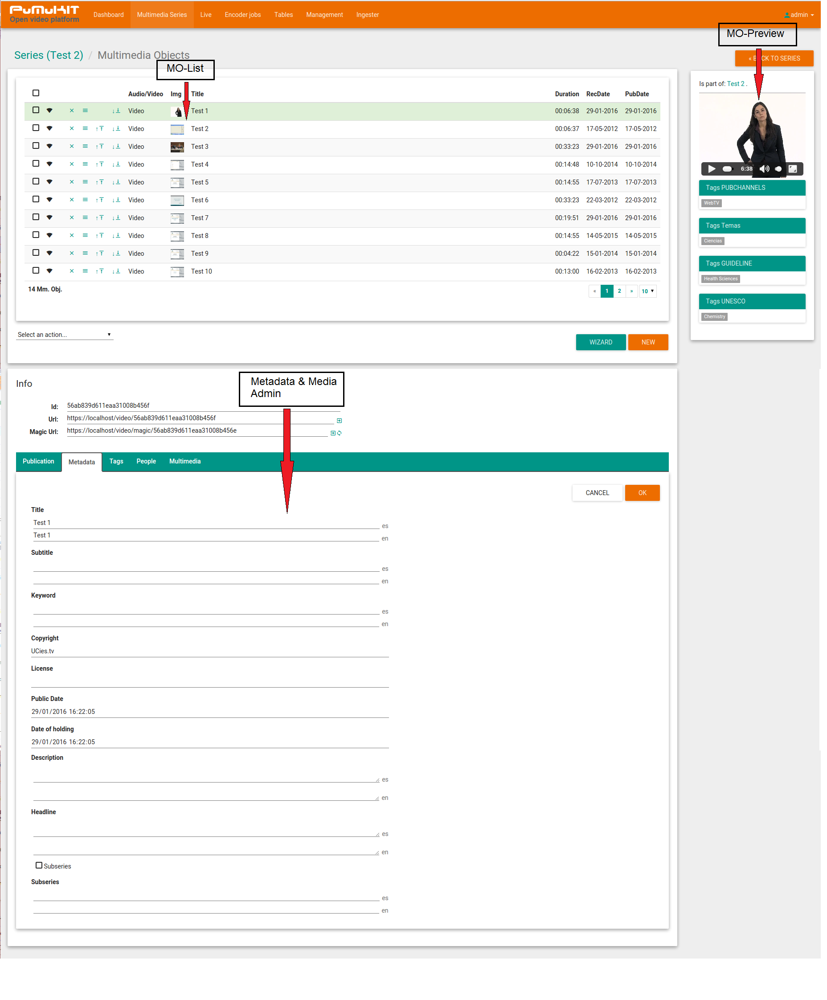
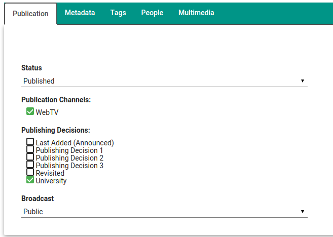

PuMuKIT-2 User Guide
====================

*This page is updated to the PuMuKIT 2.1.0 version*

# PuMuKIT Content Manager Manual

## Table of contents

1. [General Overview](#1--general-overview)

  1.1 [Terminology](#11--terminology)
  
  1.2 [PuMuKIT Overview](#12-pumukit-overview)
  
  1.2.1 [Multimedia Objects and Series](#121-multimedia-objects-and-series)
  
  1.3 [PuMuKIT Back-Office](#13-pumukit-back-office)
  
  1.3.1 [PuMuKIT Back-Office URL](#131-pumukit-back-office-url)
  
2. [Series Management](#2-series-management)

  2.1 [Series-List](#21-series-list)
  
  2.1.1 [Series-list main elements](#211-series-list-main-elements)
  
  2.2 [Series Filter](#22-series-filter)
  
  2.3 [Series metadata edition](#23-series-metadata-edition)
  
  2.3.1 [Info-tab (Metadata form)](#231-info-tab-metadata-form)
  
  2.3.2 [Videos Template-Tab](#232-videos-template-tab)
  
3. [Multimedia Objects Management](#3-multimedia-objects-management)

  3.1 [Multimedia object List area](#31-multimedia-object-list-area)
  
  3.1.1 [MO-list main elements](#311-mo-list-main-elements)
  
  3.2 [Multimedia-object metadata edition](#32-multimedia-object-metadata-edition)
  
  3.2.1 [Publication Tab](#321-publication-tab)
  
  3.2.2 [Metadata Tab](#322-metadata-tab)
  
  3.2.3 [Tags](#323-tags)
  
  3.2.3.1 [Sync KA tags button](#3231-sync-ka-tags-button)
  
  3.2.3.2 [Default KA tags](#3232-default-ka-tags)
  
  3.2.4 [People](#324-people)
  
  3.2.5 [Multimedia tab](#325-multimedia-tab)
  
  3.3 [Series and multimedia object thumbnails module](#33-series-and-multimedia-object-thumbnails-module)
  
  3.3.1 [Linking a thumbnail picture to an object (Series or   	MO)](#331-linking-a-thumbnail-picture-to-an-object-series-or-mo)
  
  2.1.2 [Importing videos from Opencast](#212-importing-videos-from-opencast)
  
  2.2 [Metadata edition](#22-metadata-edition)
  
  2.2.1 [Series metadata edition](#221-series-metadata-edition)
  
  2.2.2 [Multimedia object metadata edition](#222-multimedia-object-metadata-edition)

  2.2.3 [Series and multimedia object image edition](#223-series-and-multimedia-object-image-edition)

  2.3 [Content publication](#23-content-publication)

  2.4 [Other administration modules](#24-other-administration-modules)
  
  2.4.1 [Access module](#241-access-module)
  
  2.4.2 [Dashboard module](#242-dashboard-module)

  2.4.3 [Multimedia series module](#243-multimedia-series-module)

  2.4.4 [Live channels module (Live streaming)](#244-live-channels-module-live-streaming)

  2.4.5 [Live events module](#245-live-events-module)

  2.4.6 [Encoder jobs module](#246-encoder-jobs-module)
  
  2.4.7 [People module](#247-people-module)

  2.4.8 [Tags module](#248-tags-module)

  2.4.9 [Access Profiles module](#249-access-profiles-module)

  2.4.10 [Series types module](#2410-series-types-module)

  2.4.11 [Admin users module](#2411-admin-users-module)

  2.4.12 [Roles module](#2412-roles-module)

  2.4.13 [Opencast ingester module](#2413-opencast-ingester-module)
  
# 1  General Overview

## 1.1  Terminology 

-   **Series**: Ordered collection of multimedia objects.

-   **Multimedia Objects**: Set of media files (audio or video files), metadata and attachments (related files like ppts, pdfs, etc...). A multimedia object is composed by:
	
    - Several multimedia files: the "master" copy with maximum quality and one or several "distribution" or "delivery" copies, of the same media, encoded with different qualities or codecs.

    - Descriptive metadata, temporal and spatial-location metadata, presentation metadata and access-authorization metadata.

    - Subject area metadata.

    - Metadata about the people that takes part in the multimedia object production and their roles.

    - Attached files (PDF, PPT, etc...) and URLs that complete the content of the multimedia object.

-   **Video-Portal (Web-TV):** The video focused, youtube-like, website generated by PuMuKIT.

-   **Metadata:**Editable information of a multimedia object (title, subtitle, keyword, copyright, genre, publish date, recording date, description).

-   **Modules:**Different sections of a PuMuKIT platform.

-   **Mono-stream content:** A multimedia object based on a single video or audio.

-   **Dual-stream content:** A multimedia object based on two videos, one for presenter and one for presentation. These videos are played simultaneously and they are usually stored in an opencast platform.

## 1.2 PuMuKIT Overview

PuMuKIT is a powerful Open-Source video platform, it provides great media cataloguing capabilities as well as the required flexibility needed to manage your media collections. PuMuKIT is specially designed for organizations with large collections of video and/or audio assets.

PuMuKIT can automate the publication process of your media through different online publishing channels such as Video-Portals (WebTV), different RSS feeds, iTunesU sites, YouTube channels or DSpace repositories.

Figure 1. PuMuKit’s frontend

### 1.2.1 Multimedia Objects and Series

The **multimedia object** is the main element of a PuMuKIT video platform. The MO is a container where the video or audio files are stored together with its descriptive metadata, thumbnails, attached files, etc... A multimedia object is composed of:

-   Several media files (audio or video): The master copy (high quality copy of the media) and one or several delivery copies encoded with different qualities or codecs.

-   Descriptive metadata, temporal and spatial localization metadata, presentation metadata and access-control (authorization) metadata.

-   Metadata to catalogue multimedia objects.

-   Metadata about the people that takes part in the multimedia object production and their roles.

-   Attached files (PDF, PPT, etc...) and URLs that complete the content of the multimedia object.

Multimedia objects with a common event (symposium, meeting, etc...) or topic (subject, knowledge area, etc...) can be grouped in **Series**. A series can be considered as an organized collection of multimedia objects. ***All multimedia objects in a PuMuKIt system, must belong to a series***.

### 1.3 PuMuKIT Back-Office

The PuMuKIT back-office is a modular web application designed to manage the multimedia Series and objects of a PuMuKIT video platform. Using this back-office you will be able to ingest, catalogue and publish your media (audio and video assets) to different channels: The internal Video-Portal, iTunesU, Youtube, etc...

There are two types of users at the back-office level:

-   **Administrator**: Has full access to the platform.

-   **Publisher**: Has access to the Media Management functions but not to the administration menu (create and delete users, transcode parameter definition, etc...).

The different modules of this back-office are listed in its main menu. Just click on any of them to start working.

Figure 2. PuMuKIT Back-Office menu

### 1.3.1 PuMuKIT Back-Office URL

The URL to access the PuMuKIT back-office is:

(http://{MyPuMuKIT\_IP}/admin)

# 2 Series Management

One of the main modules of the PuMuKIT Back-Office is the Series Management module. This module is divided into 4 main areas: Series-listing, Preview of the selected series, filtering form and Metadata editing form for the selected series.

Figure 3. Multimedia Series-List

## 2.1 Series-List

The Series-List is the main section of the interface and is made up of a table listing with a row per series.

Figure 4. Multimedia Series-List

The column names in the header of the table are links that you can use to rearrange the data of the listing in ascending or descending order for: the title of the series or the date of publication. To change this order, you simply have to click on the header of the column you want to sort your data with. If it's already sorted according to this column, data will be sorted in the opposite order.

### 2.1.1 Series-list main elements

On the Series-Listing area each row represents a series. In each of those rows you will find the following elements:

-   **Checkbox**: Used to select a series or group-operations (to delete several series at the same time, for instance).

-   **Announcement indicator**: A blue <<A>> indicates that the series itself is announced in the "Recently Added" area of the home page. A grey <<A>> indicates that the series has some multimedia objects that are announced in the same area of the home page. Refer to section 2.3.1 for more information.

-   **Broadcast level icon**: The broadcast level of a series depends on the broadcast level of its multimedia objects and it is represented by this icon. Clicking on the icon it allows you to modify the broadcast-status of several multimedia objects from the series simultaneously, e.g. to change several multimedia objects from "Blocked" to "Published" status. See section 3.2.1. Refer to Annex 11: Diffusion-icons for a Broadcast-level icons list. 

-   **Hamburger Icon**: Quick access to multiple Series-Management funtions (only the delete funtion is available yet):

     - Delete series: Delete the series and all its multimedia objects. If the multimedia objects include Opencast videos, PuMuKIT will not delete those videos from the Opencast system. Just the linked PuMuKIT-MO (created in the import-process) will be deleted.
     
-   **Link to "videos"**: It provides access to the multimedia objects (videos) management module for this series. Double clicking anywhere on the row listing of a series in the Series-Listing, you will also open the MO management module.

-   **Thumbnail**: A small picture representing the serie content.

-   **Title**: Title of the series.

-   **Date**: Date of publication of the series.

-   **NumObj**: Number of multimedia objects in the series.

## 2.2 Series Filter

Thanks to these filters, you can narrow down results on the Series-List area and easily locate the series you are looking for. Using this filter-form, you can create filters based on the title, date or broadcast-states. To optimize the size on screen of the Series filter-form it works as an accordion collapsing the non used fields. The fields of the filter-ignore accent marks and are case insensitive you can use "*" as the wildcard character.

Figure 5. Multimedia series's filter-form

## 2.3 Series metadata edition

By selecting a multimedia series in the Series-list (cliking once in the series row), you will have access to its metadata editing form, below the Series-List area. The metadata editing form is divided into two tabs: "Info" and "VideosTemplate".
On the top of the metadata editing form there is an Info section which is showing the Id, the URL and the "Magic" URL of the Series:

-   ID: Unique identifier of the series.

-   URL: URL to the series in the public Video portal.

-   Magic URL: Special URL that gives access to all the MO of a series even if they are hidden. Useful when someone should review the MO before being published. You can send the "Magic URL" to the reviewer.

     - Refreshing Magic URLs: You can delete the Magic URL for a given series and create a new one with the "recycle" icon. That way people with the old Magic URL will not be able to obtain access to it anymore.

Figure 6. Multimedia series info section

### 2.3.1 Info-tab (Metadata form)

Selecting this tab you will have access to the descriptive metadata (title, subtitle, etc...) and presentation metadata (thumbnail, HTML header and footer, etc...) of the series.

As it is shown in the picture below, the form has the identifier of the series you are modifying, as background image. 

Figure 7. Multimedia series metadata editing form

You will find the following metadata fields in the form:

-   **Last Added checkbox**: If you select it, this series will be included in the "Recently Added" area of the video portal home page.

-   **Title**: It is used to define the title of the series and it is mandatory. Several title-fields are available for the different languages defined in the platform.

-   **Subtitle**: It is used to define the subtitle of the series, if it has one. Several subtitle-fields are available for the different languages defined in the platform.

-   **Keywords**: Include here any keywords for the series separated by semicolons. It is used to improve the efficiency of the searches.

-   **Copyright**: Field where the copyright owner of the contents of a series is defined.

-   **License**: Field where the license of the media is defined (Creative Commons, etc...)

-   **Channel**: Useless field that will soon be removed.

-   **Date of publication**: It is initialized with the date of the creation of the series. It's easy to modify thanks to the calendar widget.

-   **Description**: Include here a short description of the series. Several description-fields are available for the different languages defined in the platform.

-   **Images**: One or more small images (thumbnails) related to the series. You can modify the order, delete or insert new ones. See section 3.3.

-   **HTML texts**: In these text boxes, you can add raw HTML content both to the header and footer of the series for decoration purposes.

-   **Headline**: Text that replaces the subtitle of the series when it is listed in the "Recently added" area of the video-portal homepage.

### 2.3.2 Videos Template-Tab

It allows you to set a common metadata template for each new multimedia object created in that series. This is a very powerful tool that saves a lot of time in daily operation.

Figure 8. Default video metadata template

-   When creating or importing MOs to a series from Opencast, this default metadata will be assigned to each one of them. If the "Description" field is present in OC Metadata it will be kept and not overwritten.
 
# 3 Multimedia Objects Management 

This is a module to manage the multimedia-objects of a given series. Usually you will get access to this module by double.clicking a series row in the series management interface.The title of the series whose objects are being managed is displayed on the header of this page. In addition, there is a button that allows you to go back to the series-management module.

The user interface of this module is very similar to the series-management one. It is divided into the multimedia-objects listing area, the preview area and the metadata and media admin area. This module does not have a filtering form because generally a series does not hold a high number of multimedia objects and filtering is not necessary. 

Figure 9. MO management module

When you click on an item of the MO-list, this MO will be selected, updating the preview and Metadata-editing area with this MO data. The preview area will show a video player and some metadata (tags, people...) of the MO. 

## 3.1 Multimedia object List area

The MO-List is the main part of this screen and is made up of a table with a row for each MO. The order of multimedia objects shown in this list will also be used to display the series in any publication channel (video-portal, iTunesU, etc...).

### 3.1.1 MO-list main elements

In the MO-List area each row represents a MO. In each of those rows you will find the following elements:

-   **Checkbox**: Used to select a MO for group-operations (to delete several MO at the same time, for instance).

-   **Indicator of the multimedia object broadcasting. Announcement indicator**: A black <<A>> indicates that the MO is announced in the "Reciently Added" area of the home page.

-   **Hamburger Icon**: Quick access to multiple MO-Management functions.

     - **Delete MO**: Delete the MO. A recursive delete is performed, deleting all video files, materials (attachments) and images included in the MO. If the multimedia objects include Opencast videos, PuMuKIT will not delete those videos from the Opencast system, just the linked PuMuKIT-MO (created in the import-process) will be deleted.
     
     - **Clone MO**: (multimedia objects cloning) an intelligent cloning is performed and the same images and people are linked. Multimedia files are not copied.
     
-   **Move up icon**: It moves the multimedia object up in the list. It is used to modify the order of multimedia objects in the series.

-   **Move down icon**: It moves the multimedia object down in the list. It is used to modify the order of multimedia objects in the series.

-   **Thumbnail**: Small picture that represents the multimedia object.

-   **Title**: Title of the multimedia object.

-   **Publication date**: Publication date of the multimedia object.

-   **Recording date**: Recording Date of the multimedia object.

Below this list, there is a **"+ wizard"** button. You can use this button to add new MOs to this series.

There is also a **"Select action"** box. This control allows you to delete or modify the state of several multimedia objects at a time (the ones with the checkbox selected).

Figure 10. Multimedia object's info section

By selecting a MO in the MO-list (clicking once in the MO row), you will have access to its metadata editing form, below the MO-List area. The metadata editing form is divided into five tabs: "Publication", "Metadata";"Tags","People", and "Multimedia".

On the top of the metadata editing form there is an Info section which is showing the Id, the URL and the "Magic" URL of the MO:

-   ID: Unique identifier of the MO.

-   URL: URL to the MO page in the public Video portal.

-   Magic URL: Special URL that gives access to the MO even if it is hiden. Useful when someone should review the MO before being published. (You can send the "Magic URL" to the reviewer to give him private access to the video).

     - Refreshing Magic URLs: You can delete the Magic URL for a given MO and create a new one with the "recycle" icon. That way people with the old Magic URL will not be able to access to it anymore. 

## 3.2 Multimedia-object metadata edition

Selecting a multimedia object in the MO-list (clicking once on the row), you will have access to its metadata editing form, below the MO-List area. Since the multimedia object (MO) is the main part of the PuMuKIT database and holds lots of information, the Metadata & Media editing section is quite large. Therefore, it is divided into five tabs and as background image the ID of the multimedia object is shown. The tabs are: Publication, Metadada, Knowledge areas, People and Multimedia (media files). 

Figure 11. MO Metadata & Media tabs

### 3.2.1 Publication Tab

This first tab includes metadata related to the publication of a multimedia object.

-   **Status**: It indicates the Publication-state of a multimedia object. The possible publication-states of a MO are "Published", "Blocked" or "Hidden".  Publication-Status affects to all the Publication-Channels. You can select the "Blocked" status to temporarely un-publish a MO on all the channels, for instance.

-   **Publication channels**: a set of selectors that allow you to publish a multimedia object in the different online channels.

-   **Publishing decisions**: Set of selectors that allow to catalogue the multimedia object by globalizing it into one category as the frontend of the website is displayed. 

-   **Broadcast**: Through this, you can modify the ACLs of the video (public, password locked, etc...). In some PuMuKIT deployments the LDAP profile is available so users in a LDAP server will be able to access the MO using their LDAP user and password.

Figure 12. Multimedia objects publication tab

As you can see, there are different publication channels where you can publish multimedia objects. A multimedia object can be published in one or several channels like the internally generated Video-portal (WebTV), iTunesU RSS or YouTube. When a publication channel is selected, before publishing it, the file is automatically transcoded if required to match the specifications of the channel (MP4-H264 for iTunes, for instance) .The MO will not be published until this transcoding task is finished.

### 3.2.2 Metadata Tab

This tab gives access to descriptive and presentation related metadata of the MO. The form in this tab includes the following fields:

Figure 13. Metadata edition form

-   **Title**: It is used to define the title of the MO and it is mandatory. Several title-fields are available for the different languages defined in the platform.

-   **Subtitle**: It is used to define the subtitle of the MO if it has one. Several subtitle-fields are available for the different languages defined in the platform.

-   **Keywords**: Include here any keywords for the MO separated by semicolons. It is used to improve the efficiency of the searches.

-   **Copyright**: Field where the copyright of the MO is defined.

-   **License**: Text field for licensing information (Creative Commons-SA-BY, etc...).

-   **Public date**: It is initialized with the date of the creation of the series. It's easy to modify using the calendar widget.

-   **Record date**: Recording date of the multimedia object. It is initialized with the creation date of the multimedia object. Mandatory field.

-   **Description**: Include here a short description of the MO. Several description-fields are available for the different languages defined in the platform. 

-   **Headline**: Text that replaces the subtitle of a MO when it is listed in the "Recently added" area of the video-portal homepage.

### 3.2.3 Tags

The "Tags" tab allows you to catalogue a multimedia object in the defined knowledge categories. Knowledge areas (KA) are divided in "domains". A MO can be catalogued in one or several domains. A MO can be catalogued in more than one knowledge area at the same time for each domain.

In this user interface, for each "domain" you will see 2 areas:

-   Knowledge areas list (right box): lists all the tags available.

-   Knowledge areas selected (left one): lists the selected tags for this MO.

If you want to catalogue a multimedia object (MO) in a specific area, you just have to select it in the listing on the right and click on the arrow to include it in the left listing. If you want to remove a KA tag from a multimedia object then you have to do the opposite.

#### 3.2.3.1 Sync KA tags button

In the upper right corner of this tab you can see the button "SYNC IN THIS SERIES". By clicking on this button the KA tags of all the MO the Series will be substituted by the current KA tags of this object. This is another way to tag all the multimedia objects of a Series at once.

#### 3.2.3.2 Default KA tags

If the KA tags of all the MO of a series are going to be the same, you can modify the default
"Video Template" of the Series (Section 2.3.2) specially the default "Tags-Tab" for that series (this is especially helpful when importing Opencast recordings). Doing that, every new multimedia object of the series will have these KA tags set by default when it is created.

Figure 14. Multimedia object's areas tab

### 3.2.4 People

In this tab you can include people related to the MO in different roles. It is divided in blocks, each one corresponding to the different roles that a person can have related to a video (actor, organizer, producer...). You can modify the order of the people listed in each role with the arrows in the list. You can also edit the attributes of the people, without using the "people module". In addition, you can remove a person from the multimedia object. (NOTE: If you remove a person that is not related to another multimedia object, you will be deleting him/her from the database). Using the "new" button, you can add a new person to the MO while creating it in the database or add an already existing person to the object.

Figure 15. Multimedia object’s people tab

If you click on the "new" button, you will access to a form where you can write the name of people you wish to add; while you start typing the name, you will see a list of people already in the database with a name matching the written caracters. For example, after typing "Rubén" you will see listed all "Rubén" in the database and after typing "Ruben go" you will only see listed those people named "Rubén" and with a surname starting with "go" as González or Gómez.

After typing the full name, if the person is already in the database, he or she will be listed. After selecting the person and pressing the "use" button, he/she will be linked to the multimedia object. If he or she is not in the database, after typing the full name you will see an empty list, at that point you can click on the "new" button to create this new person in the database. A new form will open and you will finish filling the relevant data for the person.Once you are done the person will be created and linked to the multimedia object. You have to be careful with the position you give to the people because it's not the same Rubén González González as a student or as a programmer. A person in PuMuKIT is a combination of name and position.

The next image illustrates this process:

Figure 16. People search form

### 3.2.5 Multimedia tab

This tab gives you access to the MO media files (the essence of the digital object), and also to other attached files. It is formed by four areas:

-   **Images**: A list of thumbnails or small images linked to the multimedia object. You can modify its order, delete them or insert new images. See section 3.3.

-   **Video files**: List of media files of the multimedia object. You can upload new "master" video files, modify, arrange, preview or delete them.

-   **Materials**: List of additional files (attachments) of the multimedia objects (PowerPoint files, PDFs...). You can create new ones, modify, arrange or delete them.

-   **Links**: List of URLs related to the multimedia object. You can create new ones, modify, arrange or delete them.

Figure 17. Multimedia object’s multimedia tab

## 3.3 Series and multimedia object thumbnails module

This module is used by the series-module and the MO-module to list thumbnail images linked to the different MO or series. It also allows you to link new images.

Both series and multimedia objects have a certain number of representative thumbnails assigned, mainly obtained from a frame of the video or the logo of the event.

### 3.3.1 Linking a thumbnail picture to an object (Series or MO)

There are three different ways to link a thumbnail picture to a MO or Series:

-   **Using an external URL**: This is used to link to an existing image hosted in an external HTTP server.

-   **Uploading a local image**: You can upload an image file from your local hard drive. The image will be resized by the PuMuKIT server to save space and optimize page loading speed. 

-   **Using an existing image**: The last used images are listed in pages so you could reuse them. You can advance through the different pages with the "previous" and "next" buttons.

These three methods to link images correspond to the three areas of the thumbnail management form.

Figure 18. Thumbnail management form

After linking one or more Thumbnails to a MO or series using this module, you will be able to see those linked thumbnails in the Multimedia-Tab of the referred object:

Figure 19. Thumbnails in the Multimedia-Tab of a MO

A thumbnail can be linked to more than a multimedia object. If a thumbnail image is removed from an item, but it is linked to another one, it is not deleted. If it is only linked to an item and the link is removed the image will be deleted.

In the MO management module, the new thumbnail can be posted in two different ways:

-   If the content of the multimedia object is a video, you can extract a thumbnail from the video frames. Using the "Photo" button, an image will be extracted at the selected instant of the video.

Figure 20. Photo tool (Frame Capture tool)

-   The thumbnail can be uploaded to the server from your computer by clicking on "New Image". These images are resized on the server to optimize space and reduce the bandwidth needed to display the portal.

Figure 21. Picture edition form

Figure 4. Wizard button

This wizard is composed of three steps:

-   **STEP 0**: The wizard will show you a new window to complete the metadata title and description of the series that will contain the new multimedia object. If the wizard is run from within an existing series this step will not be displayed and the new media object is stored in said series.

Figure 5. Wizard Step 1

-   **STEP 1**: In this step, you can select if you want to upload one single multimedia object or a group of them in the series.
    

Figure 6. Wizard Step 2

-   **STEP 2**: A window to complete the metadata title, subtitle, description of new object and headline. This step will not be displayed if you select “Add multiple multimedia objects” in the previous step.

Figure 7. Wizard Step 3

-   **STEP 3**: Finally, a window to complete technical metadata about the publication of the video. The metadata to complete are:

    -   *Master*: Quality video/audio master; you can store a copy of the video to catalog with "master-copy" or compress a bit using "master-video-h264". If the video takes up much space you should use "master-video-h264". You can upload audio files using “master-audio-aac” profile.

    -   *Publication**Channels*: Multimedia channels where newly created object will be published: Web TV, ARCA…

    -   *Priority*: Priority of transcoding. It is used to set the priority of the video in the transcode queue.

    -   *Language*: Audio language of multimedia files being catalogued with the wizard.

    -   *Mode*: The way in which the file is uploaded to create the multimedia object. It may be "Local hard drive" to upload a file stored on the local computer or "Inbox on Server" to select a file stored on the server file.

    -   *Resource (local or server):* Field used to select the local file or server, depending on the selected mode.

Figure 8. Wizard Step 4

-   **FINAL STEP**: This window shows the result of the wizard and it allows you to choose some actions:

    -   See Multimedia Object data

    -   Create another Multimedia Object in same Series

    -   Create another Multimedia Object in a new Series

Figure 9. Wizard Final Step

After completing the wizard, the multimedia object with the specified metadata is created, the file is transcoded, catalogued and when it ends you can see in the "Multimedia" tab on the block “Video Files”.

### 2.1.2 Importing videos from Opencast

Once the video processing has finished in Opencast, click on the “Ingester” module to go to the next window:

Figure 10. Opencast Ingester module

A list of the videos already processed in Opencast can be seen sorted by recording date.

Information showed about the video:

-   Opencast id.

-   Title of the video in Opencast.

-   Opencast series name.

-   Duration of the video.

-   Recording date.

-   “Import” (or “Imported”) and “play”. Click on “play” to open a window with the playback of the video in Opencast. Click on “import” to add the video to its corresponding series and ready to be edited, changing its state to “Imported”. Click on “Imported” to go to the PuMuKIT series where the video is placed (see sections 2.1.2.1, 2.1.2.2 and 2.1.2.3).

There is also a searcher that allows us to find videos sorted by any of the Opencast data (presenter, title, id…).

Figure 11. Opencast Ingester video searcher

When importing the video, the program will behave differently depending on which of these cases is true:

-   It is the first imported video of the series.

-   There are already more videos of the series.

-   The video doesn’t have a series in Opencast.

#### 2.1.2.1 First video of the series

In this case, a new series will have been created in PuMuKIT associated to the Opencast series (from now on all the videos from that Opencast series will be imported in this series).

In this case, the data of the series in PuMuKIT and the metadata of the video must be edited. Both the series and the video will keep some of the data they had in Opencast: title, description, date... However, other fields must be filled in, like person, photo…

In series with more than one video, it is recommended to edit the default values of the multimedia objects before importing the rest of the videos of the series.

#### 2.1.2.2 More videos of the same series

In this case, it is only necessary to edit the metadata of the video (because the series will be already created in PuMuKIT). The generic data of the series will be updated automatically when importing the video and will also keep the data from Opencast: title, description, date...

#### 2.1.2.3 Videos without a series in Opencast

In this case, a new series (“MediaPackages without series”) without any kind of information will be created in PuMuKIT. (See more in editing metadata of a series).

If you don’t edit any metadata of this series, the following videos without a series in Opencast will be added to this series after import them. When you edit any metadata of this default series, another series with this name will be created with the following video imported.

If you wanted to move the video to other series, you would have to select the video, cut the multimedia object, go to the new series and paste it there.

## 2.2 Metadata edition

### 2.2.1 Series metadata edition

The administration of all series is made in their module. This module has two utilities:

-   *Administration*: Creating, deleting and editing the series in which multimedia objects are catalogued in the application.

-   *Access*: This utility provides access to the administration module of the multimedia objects of each series. Multimedia objects are not administrated all together at a time. Instead, the series are listed in the administration module. Using this utility, one series can be selected and a list with the objects of that series will be accessed. This means that, in the administration module of multimedia objects, you can only administrate the multimedia objects of a series.

The administration interface of the series of multimedia objects is divided into: listing of series in pages, previewing of the selected series, filtering form and administration form of the selected series.

In contrast with the other modules, whereas those appeared when it’s necessary in a higher layer in a modal way, in this module and the one of multimedia objects, the form is shown permanently on the bottom of the interface. This enables a faster access.

The listing of series is the main part of the interface and is made up of a table with a row for each entry. It is very easy to use due to the division in pages used, the filtering and the management of data. The listing includes pages to guarantee a good performance of the application, because you can only obtain the data of the rows shown in the current page. It also allows a good usability because you can manage even a list with millions of rows with the help of the previous/net
buttons to access pages one at time.

You can select the number of videos shown in each page.

Figure 12. Page buttons

The columns which form the header of the table are links that you can use to rearrange the data in the listing in several ways: in ascending or descending order of according the title of the series, the date of publication or the number of multimedia objects it has. To change this order, you simply have to click on the header of the column you want to
arrange in ascending order. If it was already arranged according to this column, data will be arranged in a descending order. In each entry of the table, the following columns are detailed, as it’s shown in this image.

Figure 13. Multimedia series's column options

-   *Checkbox* to simultaneously delete several series.

-   *Newness indicator*: A blue «A» indicates that the series is announced and a grey «A» that the series has just some multimedia object announced.

-   *Broadcasting of the series indicator*. The broadcasting of a series depends on the broadcasting of their multimedia objects. It allows to modify the broadcasting of every multimedia object of the series simultaneously, e.g. to move all the multimedia objects from “Blocked” to “Published”.

-   *Edition of the series button*.

-   *Link to videos*: access to the edition module of multimedia objects which belong to a series. If you make double click in the row of a series, you can also have access to the module of the edition of multimedia objects. Thus, the accessibility is increased.

-   *Thumbnail*: represents a series.

-   *Title of the series*.

-   *Date of publication* of the series.

-   *Number of multimedia objects* in the series.

Thanks to the filters, you can see fewer results and obtain quickly what you are looking for. You can configure the filters with a form. In this form, you can create filters depending on the title, involved people, recording places, channels, broadcasting, states… To reduce the size that may occupy the form if all configuring fields are shown the form
has the shape of an accordion. Therefore, the usability of the system is improved. Each brand of the accordion is shown separated from the next image. The fields of the filtering form are case or accent mark insensitive and use "\*" as wildcard character.

Figure 14. Multimedia series's filters

If you make double click on an item of the list of series, you have access to the edition module of multimedia objects which belong to that series. With one click, you select the item in the list of the selected series. Inside all the different metadata of the series structure, which you can modify through the form, we can distinguish two types: firstly,
the descriptive metadata of content such as title, subtitle, etc. And, secondly, the metadata representing the portal as design, header of HTML

As it’s shown in the image, there are the following fields:

Figure 15. Multimedia series's info edition form

-   *Title*: Field of text which can be adapted internationally. It is used to insert the title of a series and it’s mandatory.

-   *Keywords*: Field of text which can be adapted internationally and include keywords separated by semicolons. It is used to improve the efficiency of the searches.

-   *Copyright*: Field in which the copyright of the contents of a series is defined.

-   *License*

-   *Channel*: List with the types of series, where you can select the one that correspond with the series. These types of series are administrated with their corresponding module.

-   *Date of publication*: it is initialized on the date of the creation of the series. It’s easy to modify due to a calendar. Its structure is validated.

-   *Description*: Text area which can be adapted internationally and describes briefly the series.

-   *Images*: List of images related to the series. You can modify the order, delete or insert new ones. See section 3.2.3.

-   *HTML texts*: In these text boxes, you can add HTML both for the header and footer of the series.

-   *Headline*

#### 2.2.1.1 Edition of the series options

When clicking on the series options icon it will show this option:

-   Delete series: Delete the series and all its multimedia objects. If the multimedia objects are Opencast videos it wouldn’t delete the video, just its importation to PuMuKIT.

#### 2.2.1.2 Videos Template

It allows to set common metadata for every multimedia object of the series. (See section 2.2.2 for further details)

Figure 16. Multimedia series’s metadata edition form

When creating or importing a multimedia object of the series from Opencast, metadata will be assigned to each one of them, except for the “Description” field. When importing a video from Opencast, the default “Description” field will be used only if the video “Description” field of Opencast is empty, in this case it will keep the metadata.

### 2.2.2 Multimedia object metadata edition

This is a module to administrate multimedia objects of series. You can access through the series administration module and it shows only multimedia objects of series. The title of the series whose objects are administrated is on the interface header and by clicking on it allows you to move back to the module of the administration of series.

The administration interface of multimedia objects is very similar to the series administration module. The interface is divided into the sequential list of multimedia objects, the previewing and the administrator of the selected multimedia object. The order of multimedia objects inside a series is defined by the cataloguer and consequently the list is shown in that way. This module does not have a form to make the filtering because generally a series doesn’t have many multimedia
objects and, making it unnecessary.

In the image you can see in more detail a row of the list of multimedia objects. The following items are included in that:

Figure 17. Multimedia object's column options

-   *Checkbox* to simultaneously delete several series.

-   *Indicator of the multimedia object broadcasting*.

-   *Newness indicator*: A black «A» indicates that the multimedia object is announced.

-   *Delete button*of the multimedia object*.*After confirmation the elimination, a recursive elimination is performed, deleting all video files, materials and images to which the object is related.

-   *Edition button*of the multimedia object. This includes one option: delete.

-   *Buttons to move up*the multimedia object a position or place it the first. It is used to modify the order of multimedia objects of series.

-   *Buttons to move*down the multimedia object or placed it the last. It is used to modify the order of multimedia objects of series.

-   *Thumbnail* which represents the multimedia object.

-   *Title of the multimedia object*.

-   *Recording date* of the multimedia object.

-   *Publication date*of the multimedia object.

Below this list, there is a button to create new multimedia objects inside the series you are administrating and a button to execute the wizard inside the series. There is also a list of rapid-access that allows you to delete, announce and rearrange multimedia objects of series.

When you click on an item of the multimedia objects’ list, this is selected, updating the previewing and the administration section with the contents of this multimedia object. The previewing has a similar design as the block shown in the public web portal when the items of a series are listed. Since the multimedia object is the core part of the database, the administration section now is very big. Therefore, it is divided into five tabs: publication metadata, descriptive metadata,
tags, people and technical metadata.

Figure 18. Multimedia object's metadata tab

#### 2.2.2.1 Publication metadata

Tag with metadata related to the publication of a multimedia object:

-   *Status*: It indicates the state of a multimedia object. The states are “Published”, "Blocked" or “Hidden”. See section 2.3 Content publication.

-   *Publication channels*: a set of options which allow you to publish a multimedia object in the different channels. See section 2.3 Content publication.

-   *Publishing decisions*: Set of selectors that allow to catalogue the multimedia object by globalizing it into one category as the frontend of the website is displayed

-   *Broadcast profile*: With this, you indicate the ACLs of the video.

Figure 19. Multimedia object's publication tab

#### 2.2.2.2 Descriptive and style metadata

The tag of descriptive and style metadata which is shown in the next image is made up of a form with the following fields:

-   *Title*: Field of text which can be adapted internationally. It’s used to insert the title of a multimedia object and it’s mandatory.

-   *Subtitle*: Field of text which can be adapted internationally. It’s used to insert the title of a multimedia object, if this has one.

-   *Keywords*: Field of text which can be adapted internationally and include keywords separated by semicolons. It’s used to improve the efficiency of the searches.

-   *Copyright*: Field in which the copyright of the contents of a multimedia object is defined.

-   *License*

-   *Public date*: Publication date of multimedia objects. It is initialized on the date of the creation of the series. It’s easy to modify due to a calendar. Its structure is validated.

-   *Record date*: Recording date of the multimedia object. It is initialized with multimedia object’s creation date. It’s easy to modify due to a calendar. You have to make sure this date is not bigger than the publication date and it has a valid format.

-   *Description*: Text area which can be adapted internationally and describes briefly the multimedia object.

-   *Headline*

Figure 20. Multimedia object's metadata edition form

#### 2.2.2.3 Tags

This tag allows you to catalogue multimedia objects depending on the defined categories. You can add, edit and delete categories at any time through this module. Knowledge areas are divided in domains. A multimedia object can be catalogued in more that one knowledge area at the same time.

In the interface, where you can observe an entry for each type of area, there are two lists; the second one with all knowledge areas of this type and the first one with the areas in which the multimedia object is catalogued. If you want to catalogue a multimedia object in a specific area, you just have to select it in the second list and click on the
arrow which points to the first list. If you want to change the catalogue of a multimedia object, you have to do the opposite. To increase the speed of cataloguing, the previous process can be simplified in making double click in the area.

If the areas of knowledge will be the same for all the multimedia objects of a series, it is recommended to modify this value in "Videos Template" tag of that series. With this, every new multimedia object of the series will have this value when it is created.

Figure 21. Multimedia object’s tags tab

#### 2.2.2.4 People

As the “Tags” tag, the area to catalogue people is divided in blocks, corresponding each block to each of the roles that a person can have inside a video. There is an entry for each role and inside that there is a list of people related to the multimedia object. You can modify the order of the people listed in each role with the arrows in the list. You can also edit the attributes of the people, without using the people module (directly from the multimedia objects administrator). In addition, you can decouple a person from the multimedia object. If you decouple a person which is not related to another multimedia object, it gets deleted from the database. In the “new” button, you can insert a new person or an existing person in the object.

Figure 22. Multimedia object’s people tab

If you click on the “new” button, you access to a form where you can write the name of people you wish to add; while you are typing the name, you can see a list with catalogued people with this name in the database. For example, after typing “ruben” you will see listed all “Rubén” in the database and after typing «ruben go» you will only see listed those people with a surname which starts with “go” as González or Gómez. After typing the full name, if the person is already in the database, he or she will be listed. After selecting him/her and press the “use” button, he/she will be linked to the multimedia object. If he or she is not in the database, after typing you will not see a list and you would click on the “new” buttom to finish filling the data of the person and linking him/her to the multimedia object. You have to be careful with the position you give to the people because it’s not the same Rubén González González as a student or as a programmer.

The next image illustrates this process:

Figure 23. People search form

#### 2.2.2.5 Technical metadata

The last tag of the multimedia object technical metadata is made up of four entries:

-   *Images*: List of images linked to the multimedia object. You can modify its order, delete them or insert new images. See section 2.2.3.

-   *Video files*: List of multimedia files of the multimedia object. You can create new ones, modify, arrange, preview or delete them.

-   *Materials*: List of materials of the multimedia object. You can create new ones, modify, arrange or delete them.

-   *Links*: List of links of the multimedia object. You can create new ones, modify, arrange or delete them.

Figure 24. Multimedia object’s multimedia tab

##### 2.2.2.5.1 **Download a master and a publishing copy of a mono-stream video**

For those videos that are not imported from Opencast, you can download a copy of the master and publication file of the recording on this tab.

Figure 25. Download a video

We can see from video files to various icons appear to us before the name and identifier of the video. If you click on the arrow icon down, it downloads a copy of this video.

This would also be true for SBS generated from imported files from Opencast.

### 2.2.3 Series and multimedia object image edition

This module is used by the series module and the multimedia object module to list images linked to different multimedia objects or series. This also allows you to link new images.

Both series and multimedia objects have a certain number of little representative images, mainly obtained from a frame of the video or the logo of which you record. These images can be arranged from the “Multimedia” tab in order to change the order in which they appear on the Web portal.

There are three different ways to link new images:

-   Indicating the URL of the image: This is used to indicate an existing image in another HTTP server.

-   Uploading a local image: Uploading a new image of the client server is the most used method. These images are resized in the server to save space and reduce the bandwidth needed to show the portal.

-   Using an existing image: The last used images are listed in pages so you could reuse them. You can advance throughout the different pages with the “previous” and “next” buttons.

These three methods to link images correspond to the three parts of the form to insert images. You can see it afterwards.

Figure 26. Picture edition form

In the next image, you can see the partial item of the series and multimedia object forms in the four tags. This allows you to link new images clicking on the link of new image. It also allows you to delete existing images clicking on the delete button and to modify their order with the corresponding arrows.

Figure 27. Multimedia object’s picture options

An image can be linked to more than a multimedia object. If an image is decoupled of an item, but it is linked to another one, it is not deleted. If it is only linked to an item, when it is decoupled, it will be deleted.

At the multimedia objects management module, the new thumbnail can be selected in two different ways:

-   If the content of the multimedia object is a video, you can extract thumbnail from the video frames. Using the "Photo" button, an image will be extracted at the selected instant of the video.

Figure 28. Multimedia object’s publication tab

-   The image can be uploaded to the server from your computer by clicking on “New Image”. These images are resized on the server to take up less space and reduce the bandwidth needed to display the portal.

Figure 29. Picture edition form

In the next picture we show the element appearing in the “Multimedia” tab (form both the series and the multimedia objects administrators) from which you can order the images (clicking on the arrows below them).To associate new images by clicking on the link “New Image” also deletes existing images by clicking the delete button and modify your order with dates.

Figure 30. Multimedia object’s picture options

## 2.3 Content publication

The content publication is carried out through the publication tag of the edition form in the multimedia objects module. The publication is conducted for each multimedia object in unique and independent way.

Figure 31. Multimedia object’s publication tab

There are different publication channels where you can publish multimedia objects. A multimedia object can be published in one or several defined channels. When a publication channel is selected, before publishing it, the file is coded to the needed profile. Multimedia objects are not published until this transcoding is finished.

As well as the publication channels, in order to not to publish a multimedia object, you have the state, whose default value is regular. You can modify the state of a blocked multimedia object so it can’t be accessible in any channel. The utility of the channel is allowing you to unpublish a multimedia object of all publication channels in a temporary way.

You can also define access profiles for the videos and select them in the last pull-down menu. A profile can be public or private. In this private profile, you have to define a password.

## 2.4 Other administration modules

The administrative application also has other modules to perform less common administrative tasks than the publication and administration of live videos. In this section, the different existing modules will be summarized.

### 2.4.1 Access module

It is a module to have access to the application of administration. The interface is simply an access form, which is used to validate the login and the password with the list of users of the server database.

Figure 32. Access module

### 2.4.2 Dashboard module

It is a module that allows you to see a timeline of the recordings in Pumukit and information about them.

Figure 33. Dashboard module

### 2.4.3 Multimedia series module

It is a module to administrate series and their multimedia objects.

Figure 34. Multimedia series module

### 2.4.4 Live channels module (Live streaming)

It is a module that allows you to administrate real-time channels of the Web portal.

Figure 35. Live channels module

#### 2.4.4.1 Live channel configuration

From the Live channels module it can be configured the following parameters:

Figure 36. Live channels configuration

-   Name: Live channel name shown in the frontend.

-   Description: Information about the channel.

-   URL: Streaming server’s Url. This Url uses a rtmp protocol. We recommend using the AMS technology (Adobe Media Server) because it delivers multimedia content to desk and mobile devices. The Url by default is rtmp://\<URL\>/livepkgr .

It also supports FMS technology (Flash Media Server) and WMS technology (Windows Media Services).

-   STREAM: Name that identifies the video flow on the streaming server.

-   Status: There are two possible states for the channel:

    -   Live broadcasting: Enables the live streaming on the channel.

    -   On Hold: Disables the live streaming on the channel. It can be configured to play videos (waiting playlist) while there is not any live streaming on the channel.

**NOTE**: When the live streaming source is not available it is recommended to change the channel state to “On Hold”.

-   Technology: It supports FMS technology (Flash Media Server) and WMS technology (Windows Media Services). To use AMS technology you have to choose FMS. AMS is the new version of FMS that delivers multimedia content to mobile devices.

-   Resolution: Player resolution of the live channel on the Web TV portal.

-   Qualities: It allows multi-quality streams. Multi-quality streams are useful to deliver video streaming to slow Internet connections or mobile devices. Width band in kbps and width in pixels. If the width band is not configured, by default is set up to 1 Mbps.

-   IP Source: IP address of the streaming server. This parameter configures the live channel to stream only from the Ip address introduced.

-   Index play: The live streaming is announced in the Home site while it is happening. A live event must be created and configured with date and duration.

#### 2.4.4.2 Streaming encoder configuration

The streaming encoder delivers multimedia content to the streaming server. The streaming server relies the multimedia content to the user’s desktop computers and mobile devices. We recommend Adobe Media Server (AMS) as Pumukit live streaming server.

As streaming encoder Adobe Flash Media Live Encoder (FME), Wirecast and other applications can be used.

Streaming encoder configuration recommendations for AMS:

-   Select AMS technology

-   Select H.264 video codec with the following parameters:

    -   Profile: Main

    -   Level: 4.1

    -   Keyframe Frecuency: 4 seconds

-   Select AAC audio codec if available. AAC format is fully compatible with desktop computers, Android and iOS devices. Mp3 format at 44100 Hz sample rate can also be used but it might have problems with older devices (iPad 1).

### 2.4.5 Live events module

It is a module that allows you to administrate the next events that will be broadcasted through real-time channels.

Figure 37. Live events module

### 2.4.6 Encoder jobs module

It is a module that summarizes transcoding jobs: those in progress, those pending for transcoding and those finished (both correctly and incorrectly).

Figure 38. Encoder jobs module

### 2.4.7 People module

It is a module to administrate data of people linked to a multimedia object, whether they present a lecture, they are short-film actors or they have a much more technical role as producers, directors, etc. People are linked to the multimedia object through the roles that are administrated in their corresponding module.

Figure 39. People module

This module allows the creation, edition and elimination of information related to people. It also should be noted that the information storage in the database is not linked to the person but to the position. This is to say that a person with two different positions have two different entries, one per position. This is because we want to solve the problem of temporary positions as Chancellor of the University. This person has two entries: one for Chancellor and another for teacher.

### 2.4.8 Tags module

It is a module that allows you to administrate Tags areas used to catalogue multimedia objects.

Figure 40. Tags module

The different areas of knowledge are grouped depending on types, creating domains as the different grades of UNESCO’s knowledge areas, the principal domain or even the departments of an institution.

### 2.4.9 Access Profiles module

It is a module that allows you to administrate the broadcasting of multimedia objects. Broadcasting defines the scope or privacy of multimedia objects.

Figure 41. Access profiles module

Click on “new” to create a new broadcast profile, the next window will open:

Figure 42. Create new broadcast

-   Name: name of the profile, if the profile is private it will match the user name used to sign up.

-   Type: “public” for free access profiles and “private” for private profiles.

-   Passwd: password for private profiles.

-   Description: usually a descriptive phrase to know what the profile is used for. This field is not mandatory.

### 2.4.10 Series types module

It is a module that allows you to administrate the types of series (also designated as channels) in which multimedia object series of the catalogue are classified.

Figure 43. Series types module

### 2.4.11 Admin users module

It is a module to configure users who have access to the administration application. With this module, you can create, edit and delete users and their authorizations.

Figure 44. Admin users module

### 2.4.12 Roles module

It is a module that allows you to administrate roles with people linked to multimedia objects. These roles can be as follow:

-   Public: these are shown to everybody through the *feeds* and the Web portal.

-   Private: these are used internally to administrate and catalogue multimedia objects in a better way. They are not shown in the Web portal.

Figure 45. Roles module

### 2.4.13 Opencast ingester module

It allows to import videos from an associated Opencast to publish them.

Figure 46. Opencast ingester module

